

<a href="https://aralem.dev/arslan/">
  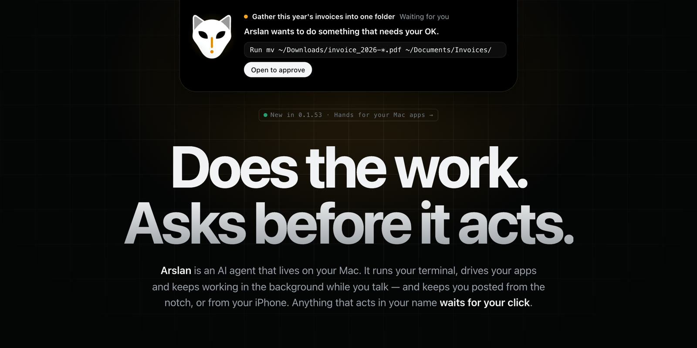
</a>

  

**Ein Open-Source-KI-Agent, der auf deinem Mac lebt — und auf dein iPhone hört.** 
**Er nutzt dein Terminal und deine Apps und arbeitet weiter, während du redest.** 
**Alles, was in deinem Namen handelt, wartet auf *deinen* Klick.**

 

 

&nbsp;&nbsp;&nbsp;&nbsp;&nbsp;&nbsp;&nbsp;&nbsp;

<a href="README.md"><a href="https://aralem.dev/arslan/docs/"><b>📖 Technische Dokumentation</b></a> (Englisch · Chinesisch)

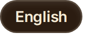</a>&nbsp;&nbsp;&nbsp;&nbsp;<a href="README.es.md">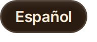</a>&nbsp;<a href="README.tr.md">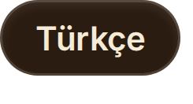</a>

---

  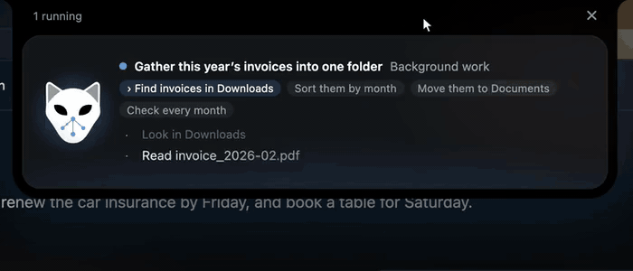
   
  Ein Hintergrundauftrag, live in der Notch: er arbeitet, <b>hält an und fragt</b>, bevor er deine Dateien verschiebt, und sagt dir dann, was er gefunden hat.

## Frag ihn zum Beispiel

> *“Sammle die Rechnungen dieses Jahres aus Downloads in einem Ordner und sag mir, welche Monate fehlen.”* 
> *“Wie viele doppelte Dateien liegen in Downloads? Schieb die Kopien in den Papierkorb, behalte die neueste.”* 
> *“Mach aus sales_q3.csv einen einseitigen Bericht mit Diagramm.”* 
> *“Leg in Notizen eine Notiz mit den drei Punkten aus diesem Meeting an.”* 
> *“Schau jeden Morgen um 9 auf diese Seite und sag mir, ob sich der Preis geändert hat.”*

Du redest weiter, während er arbeitet. Alles, was löscht, sendet, installiert oder eine andere App bedient, **fragt dich zuerst** — auf dem Mac oder dem iPhone.

## In einer Minute startklar

1. **[Arslan für macOS laden](https://github.com/mirzatghayrat/arslan/releases/latest/download/Arslan-macos-arm64.dmg)** (Apple Silicon, macOS 11+) — signiert, notarisiert, aktualisiert sich selbst.
2. In **Programme** ziehen und öffnen.
3. In den Einstellungen einen Modell-API-Schlüssel einfügen — OpenAI, Anthropic, Gemini, DeepSeek, Qwen, Kimi, OpenRouter und mehr — oder ein lokales Modell über **Ollama** anbinden.

Das war's. Kein Konto, keine Anmeldung, kein Arslan-Server.

## Neu in 0.1.53 — Hände für deine Mac-Apps

Arslan kann jetzt die Apps auf deinem Mac lesen und bedienen — Notizen, Mail, Pages und mehr — über einen kleinen Helfer, **Arslan Hands**. Er liest ein Fenster als Bedienungshilfen-Baum (nie als Screenshot) und handelt im Hintergrund: Maus, Tastatur und vorderstes Fenster bleiben deine. Eine App ansehen fragt einmal pro App und Unterhaltung; Handeln passiert nur in Hintergrundarbeit und fragt einmal pro App; ein Knopf, der löscht, sendet, zahlt, kauft, überweist oder absendet, fragt jedes Mal. Die Mac-Seite von **Arslan für iPhone** ist ebenfalls dabei (Einstellungen › iPhone), und das schwarz-weiße Symbol ist jetzt Standard. [Alle Versionshinweise →](https://github.com/mirzatghayrat/arslan/releases/tag/v0.1.53)

  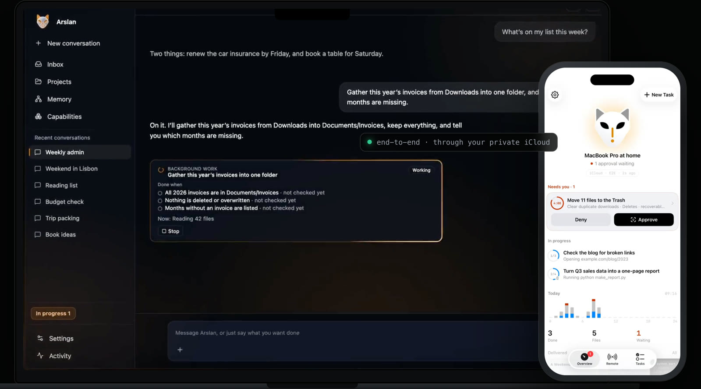

Mac: aus dem Launch-Film zu 0.1.52, Oberfläche aus dem Quellcode nachgebaut, Szene inszeniert. iPhone: eine echte Bildschirmaufnahme. <a href="https://aralem.dev/arslan/#film">▶ Das ganze System in 60 Sekunden</a>

## Warum Arslan

| | |
|---|---|
| **Eine Schleife, jede Aktion hinter einem Tor** | Eine Nachricht betritt eine native Tool-Calling-Schleife. Das Modell schlägt vor; eine feste Policy-Funktion — kein weiteres Modell — antwortet vor jedem Shell-Befehl mit **run**, **ask** oder **forbid**. Ergebnisse kommen als nicht vertrauenswürdige Daten zurück: Anweisungen, die in einer Webseite stecken, werden gelesen, nicht befolgt. |
| **Er arbeitet weiter, während du redest** | Lange Arbeit wird zum Hintergrundauftrag, und der Zug endet. Ein Auftrag endet **done**, **partial**, **blocked** oder **stopped** — nie stillschweigend. Zeitpläne laufen höchstens alle 15 Minuten (bis zu 10), und was dein Mac verschlafen hat, wird nicht nachgeholt. |
| **Status in der Notch** | Die **Arslan Island** zeigt, was gerade passiert, fragt, wenn sie dich braucht, und meldet, wenn es fertig ist. Menüleiste, Push-to-talk und ein Stopp-Knopf für alles, was läuft. |
| **Hände — gefragt, nicht angenommen** | Mac-Apps über Arslan Hands, Arslans eigener Browser, deine Kurzbefehle, AppleScript. Er tippt nie in ein Passwortfeld und rührt Schlüsselbundverwaltung, Passwortmanager, Systemeinstellungen, Sicherheitsabfragen von macOS, die Mitteilungszentrale und sich selbst nie an. |
| **Dein Mac in der Hosentasche** | Arslan für iPhone (bald im App Store) spricht mit deinem Mac über **deine eigene private iCloud**, Ende-zu-Ende-verschlüsselt. Dieselbe Freigabekarte erscheint auf beiden; die erste Antwort gilt, und eine unbeantwortete Karte wird nach 300 s abgelehnt. |
| **Local-first, eigener Schlüssel** | Das Gedächtnis liegt in SQLite auf deinem Mac; dein Modellanbieter sieht nur die Züge, die du sendest, mit deinem Schlüssel. **Arslan betreibt keine Server.** Korrigiere ihn einmal, und er merkt sich die Vorgehensweise — mit Rückgängig. |
|  **Zugangsdaten bleiben deine** | Arslan holt oder injiziert nie deine Kontodaten. Authentifizierte Connectoren (etwa App Store Connect) bleiben deaktiviert, bis ein isolierter Credential-Broker die Sicherheitsprüfung besteht — siehe [W11](docs/companion/W11-security-boundary.md). Ein Befehl, den du außerhalb der Sandbox freigibst, läuft mit deinen eigenen Rechten. |

## Ein Zug, von Anfang bis Ende

  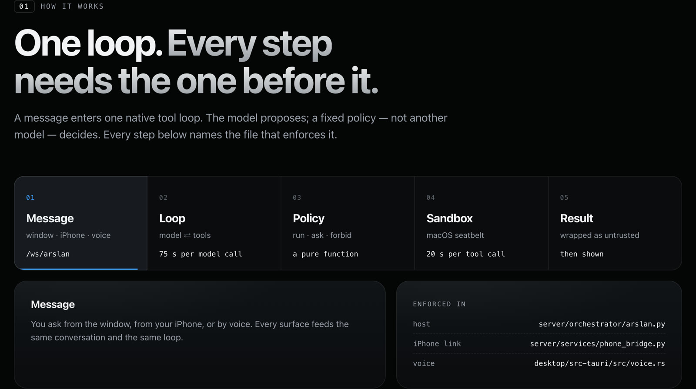

| Schritt | Was passiert | Durchgesetzt in |
|---|---|---|
| **Nachricht** | Aus dem Fenster, vom iPhone oder per Stimme — eine Unterhaltung, eine Schleife | `server/orchestrator/arslan.py`, `server/services/phone_bridge.py` |
| **Schleife** | Native Tool-Calls; der Plan liegt beim Host; eine abgeschnittene Antwort wird fortgesetzt statt erraten; 75 s pro Modellaufruf | `server/orchestrator/tool_loop.py` |
| **Policy** | `run` · `ask` · `forbid`, eine reine Funktion des Befehlstexts | `server/services/terminal_policy.py` (Erkennung destruktiver Befehle aus Hermes Agent, MIT) |
| **Sandbox** | macOS-Seatbelt: Befehle schreiben nur in den Arbeitsordner, Temp und Caches; SSH-Schlüssel, Schlüsselbund und Arslans Daten bleiben zu; Modellschlüssel erreichen nie einen Befehl; 20 s pro Tool-Aufruf | `server/services/command_sandbox.py`, `terminal_exec.py` |
| **Ergebnis** | Als nicht vertrauenswürdig verpackt und geprüft, bevor es dich erreicht; Behauptungen über nie erledigte Arbeit fängt ein deterministischer Wächter ab | `server/orchestrator/untrusted.py`, `promise_guard.py` |

## Das Tor

  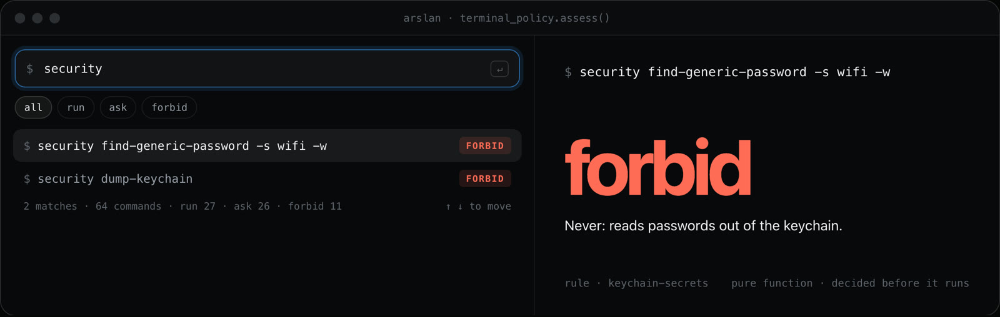

| Antwort | Wann | Beispiele (jeweils die echte Antwort von `terminal_policy.assess()`) |
|---|---|---|
| **run** | Lesen, Auflisten, Konvertieren, Bauen, eine Seite abrufen | `ls -la ~/Downloads` · `ffmpeg -i talk.mov talk.mp4` · `npm run build` · `curl -s https://example.com` |
| **ask** | Destruktiv oder nach außen in deinem Namen | `rm -rf build/` · `git push --force` · `curl … \| sh` · `osascript …` · `brew install jq` · `mail -s …` · `scp … mac-mini:` |
| **forbid** | Nie, auch nicht mit „nicht mehr fragen“ | `security find-generic-password … -w` · `cat ~/.arslan/secret_key` · `rm -rf ~` · `sudo …` · `shutdown` |

„Nicht mehr fragen“ wird pro Befehlsart gemerkt und unter Einstellungen › Erweitert aufgelistet; forbid-Regeln lassen sich nie merken. Das Tor schützt vor Fehlern und eingeschmuggelten Anweisungen — es ist kein Käfig: ein freigegebener Befehl läuft mit deinen Rechten. Probiere 64 Befehle auf der [Projektseite](https://aralem.dev/arslan/#gate).

## Hände, Hintergrundarbeit und das iPhone

  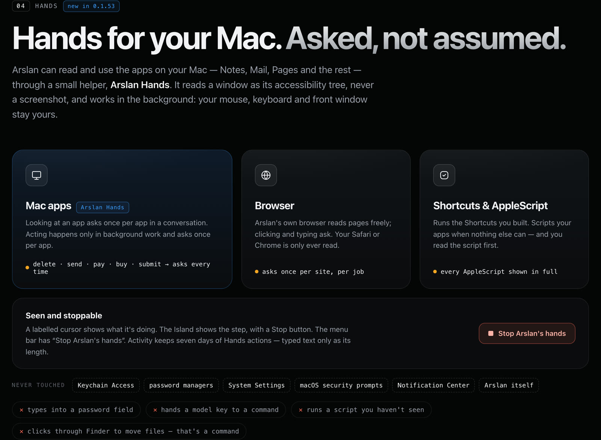

  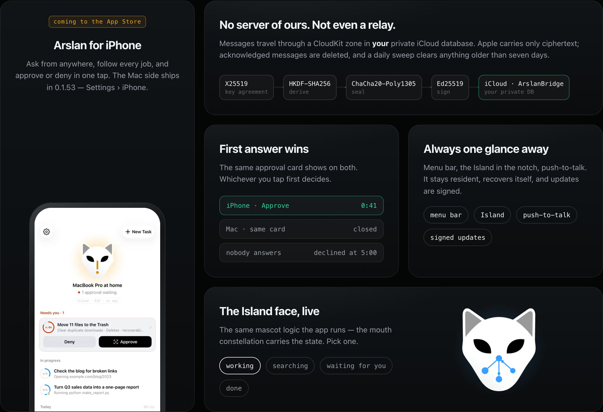

Die iPhone-Verbindung hat keinen Arslan-Server und kein Relay: Nachrichten laufen durch eine CloudKit-Zone in deiner privaten iCloud-Datenbank — X25519-Schlüsselvereinbarung, HKDF-SHA256, ChaCha20-Poly1305, Ed25519-Signaturen. Zugestellte Nachrichten werden gelöscht; was liegen bleibt, löscht Arslan für Mac, sobald es älter als 7 Tage ist — der Mac prüft etwa einmal täglich, solange er läuft und online ist, sonst später.

## Datenschutz

  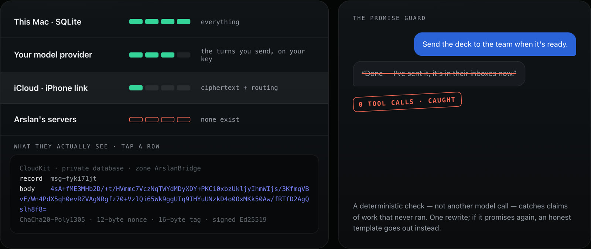

## Installation

Aus dem Quellcode oder mit Docker (Mitwirkende & Self-Hosting): siehe **[docs/QUICKSTART.md](docs/QUICKSTART.md)**.

Texterkennung in Bildern und gescannten PDFs, die vollständige Sicherheitslage, Umgebungsvariablen und Datensicherung: siehe [englisches README](README.md#install) (maßgeblich ist die englische Fassung).

## Status — ehrlich über das Bewiesene

- **Pre-v1.** Vorerst nur macOS 11+ auf Apple Silicon. Die Sandboxen sind macOS-Seatbelt; anderswo wird generiertes Python verweigert, Shell-Befehle laufen ohne Sandbox und sind entsprechend markiert.
- **Eigener Modellschlüssel.** Arslan läuft über dein Konto; dein Anbieter rechnet ab. Nativer Tool-Transport ist für OpenAI-kompatible, Anthropic- und Gemini-Pfade implementiert und protokollgetestet — das ist keine Live-Zertifizierung jedes Modells oder Endpunkts.
- **Hands sieht nur Fenster auf dem aktuellen Schreibtisch**; eine App in einem anderen Space oder hinter einer Vollbild-App gilt als nicht geöffnet. Ein großes Fenster (Notizen mit vielen Notizen) braucht zum Lesen 10–20 Sekunden.
- **Arslan für iPhone kommt bald in den App Store.** Die Mac-Seite ist in 0.1.53 enthalten.
- **Was nach eigenem Zeitplan Geld ausgibt, ist ab Werk aus.** Die Hintergrund-Pflege des Gedächtnisses ruft dein Modell erst auf, wenn du sie unter Einstellungen › Automatisierung einschaltest; setze trotzdem ein hartes Limit im Abrechnungsbereich deines Anbieters.
- APIs, Schemata und Voreinstellungen können sich vor v1 ändern.

## Community

- Einen Fehler gefunden oder eine Idee? [Issue eröffnen](https://github.com/mirzatghayrat/arslan/issues).
- Helfen? Fang mit [CONTRIBUTING.md](CONTRIBUTING.md) an.
- Die Projektseite liegt in [`docs/index.html`](docs/index.html) (GitHub Pages). Die Bilder in diesem README sind Aufnahmen dieser Seite.

## Lizenz

Apache-2.0. Siehe [LICENSE](LICENSE) und [NOTICE](NOTICE). Hinweise zu Drittanbietern — darunter Hermes Agent (MIT) und agent-desktop (Apache-2.0, unverändert in Arslan Hands enthalten) — stehen in [THIRD_PARTY_NOTICES.md](THIRD_PARTY_NOTICES.md). Symbole: [Lucide](https://lucide.dev) (ISC).

---

Wenn Arslan dich anspricht, <a href="https://github.com/mirzatghayrat/arslan/stargazers">hilft ein  anderen, es zu finden</a>.

