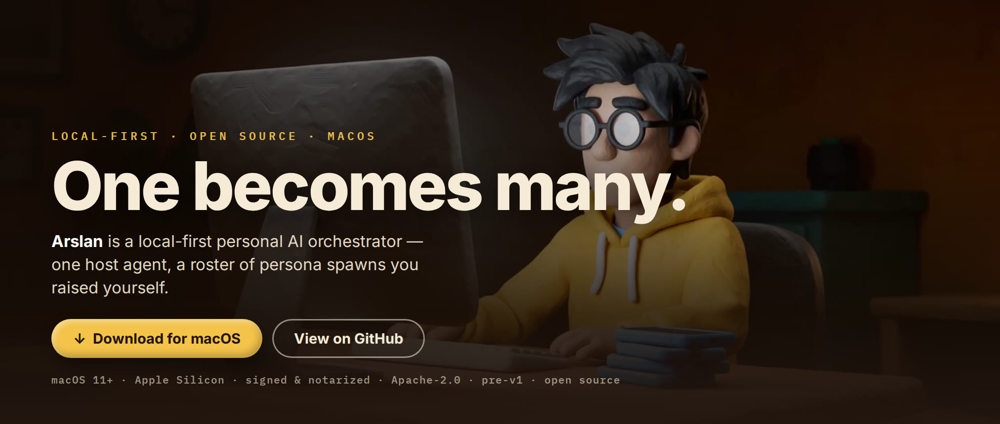
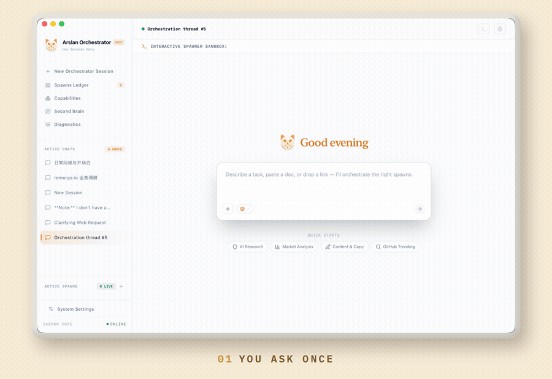
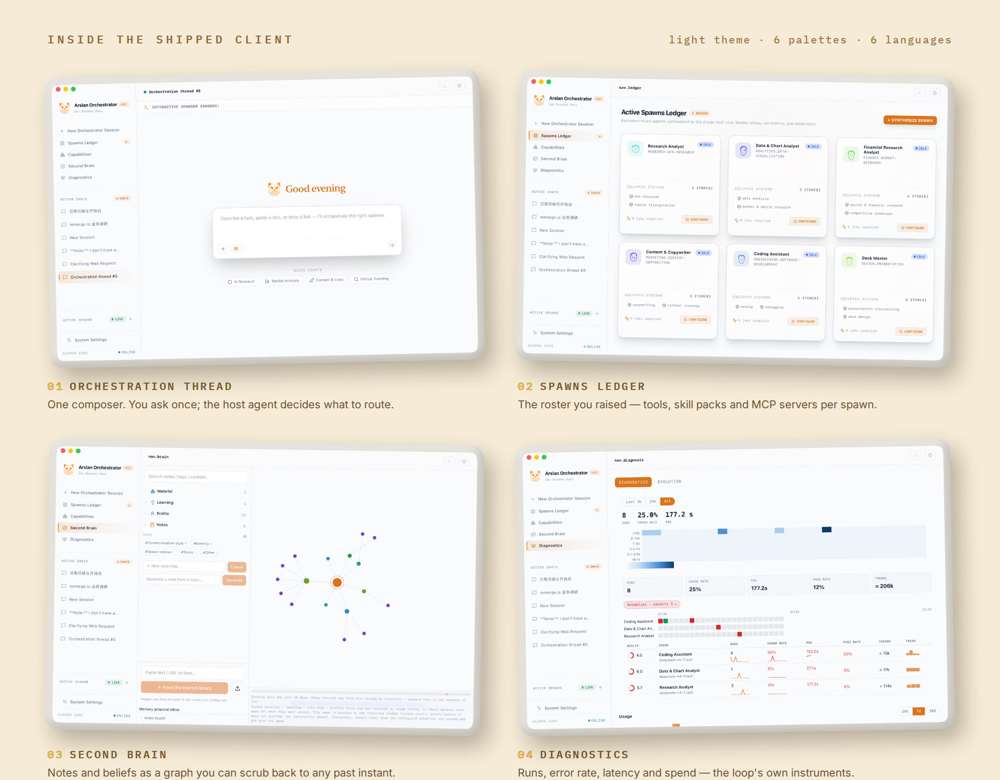
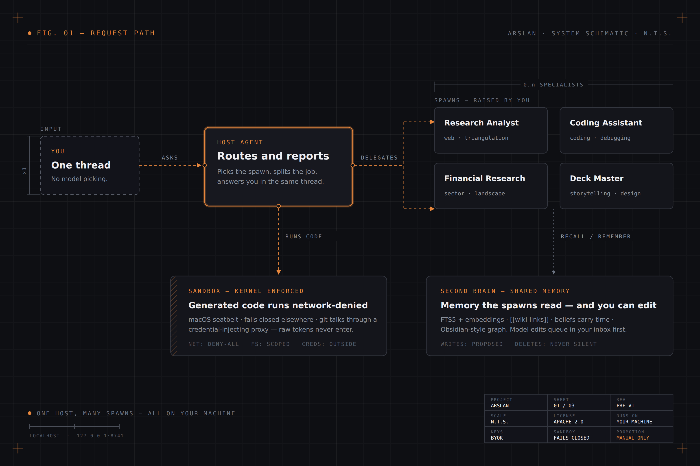
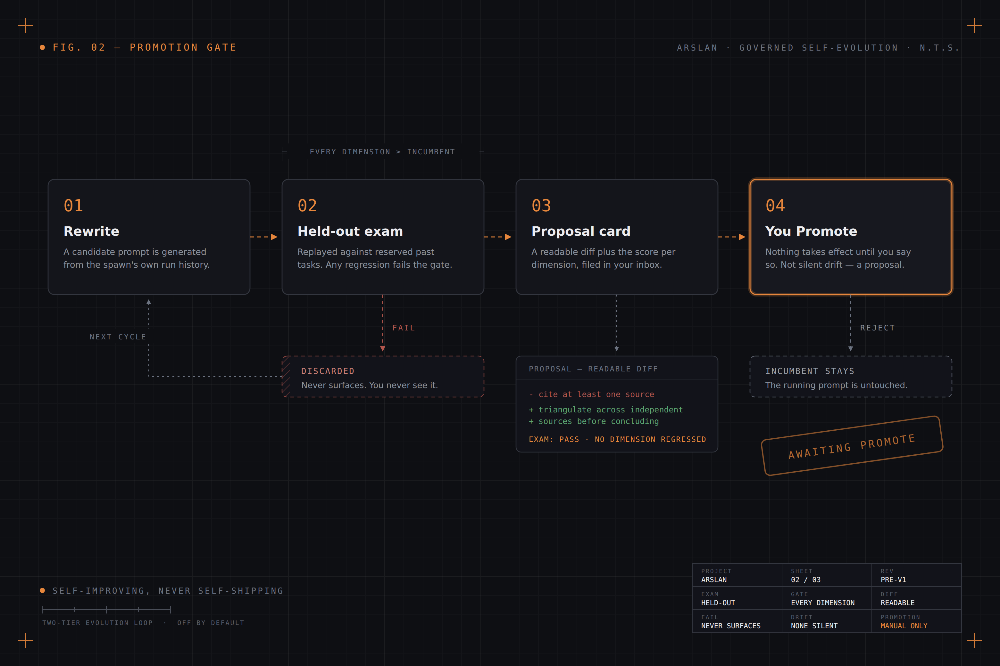
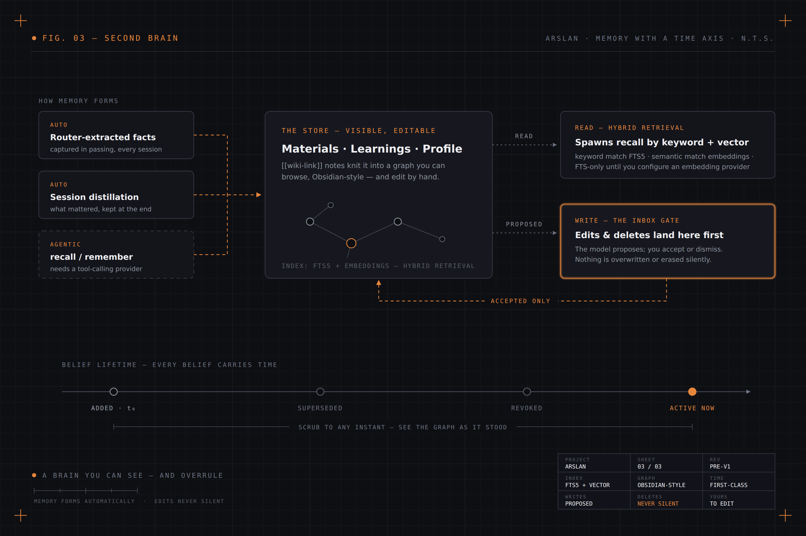
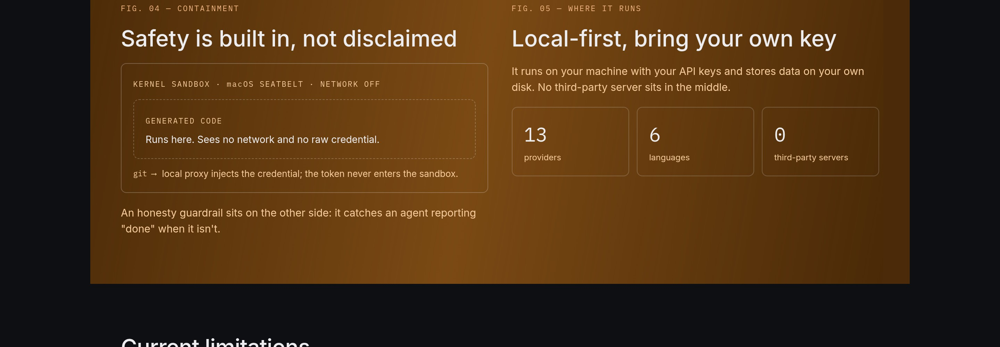

  

**Hablas con un solo agente anfitrión. Él dirige el trabajo a spawns de persona (spawns: agentes especialistas que se generan bajo tu mando) que tú mismo criaste.** 
**Sus prompts mejoran por sí solos — pero cada cambio pasa un examen held-out,** 
**y nada se aplica hasta que *tú* pulsas Promote.**

 

 

<a href="https://github.com/mirzatghayrat/arslan/releases/latest/download/Arslan-macos-arm64.dmg"> <b>Descargar para macOS</b></a>&nbsp;&nbsp;·&nbsp;&nbsp;<a href="https://mirzatghayrat.github.io/arslan/"> <b>Sitio web</b></a>&nbsp;&nbsp;·&nbsp;&nbsp;<a href="docs/QUICKSTART.md"> <b>Inicio rápido</b></a>&nbsp;&nbsp;·&nbsp;&nbsp;<a href="docs/ARCHITECTURE.md"> <b>Arquitectura</b></a>&nbsp;&nbsp;·&nbsp;&nbsp;<a href="SECURITY.md"> <b>Seguridad</b></a>&nbsp;&nbsp;·&nbsp;&nbsp;<a href="CONTRIBUTING.md"> <b>Contribuir</b></a>

&nbsp;&nbsp;<a href="README.md">English</a> · <a href="README.zh-CN.md">简体中文</a> · <a href="README.de.md">Deutsch</a> · <a href="README.ja.md">日本語</a> · <b>Español</b> · <a href="README.tr.md">Türkçe</a>

---

## Una solicitud, de principio a fin

  

<em>Pides una sola vez. El agente anfitrión elige el spawn, divide el trabajo, ejecuta el código generado en un sandbox a nivel de kernel y responde — todo en un mismo hilo.</em>

<a href="docs/assets/arslan-clay-60s.mp4"><b>▶ Ver el film de 60 segundos</b></a> — el film en animación de plastilina del que sale el <a href="https://mirzatghayrat.github.io/arslan/">sitio del proyecto</a>.  Las pantallas de arriba son el cliente publicado, sin retoques. Fuente del film: <a href="video/">video/</a>.

**Arslan es un orquestador personal de IA con enfoque local-first.** Corre en tu propia máquina, contra tus propias claves de LLM, con un **sandbox de kernel seguro por defecto**, **guardarraíles de honestidad** y un **segundo cerebro visible** que puedes explorar y editar.

## Por qué Arslan

| | |
|---|---|
|  **Un equipo de personas que tú haces crecer** | Arslan es la puerta de entrada; detrás construyes una plantilla de spawns especialistas — equípalos con herramientas, paquetes de habilidades `SKILL.md` y servidores MCP, y deja que un bucle de evolución de dos niveles los refine con el tiempo. |
|  **Autoevolución con un examen de por medio** | El prompt de un spawn se revisa a sí mismo a partir de su propio historial de ejecuciones — y luego debe vencer al titular en tareas pasadas reservadas (held-out), en *todas* las dimensiones. Si pasa → un diff legible aterriza en tu bandeja de entrada. **Nada surte efecto hasta que pulsas Promote.** |
|  **Seguro por defecto, no por descargo de responsabilidad** | El código generado corre sin red bajo un sandbox impuesto por el kernel (seatbelt de macOS). Un proxy que inyecta credenciales permite que git hable con la red desde el sandbox sin que los tokens en bruto entren jamás en él. Donde el sandbox de kernel no está disponible, **falla cerrado**. |
|  **Un segundo cerebro con eje temporal** | Materiales, aprendizajes, un perfil y notas con `[[wiki-link]]` — recuperación híbrida FTS5 + embeddings, navegable como un grafo de fuerzas al estilo Obsidian. Las creencias llevan tiempo: cuándo se volvió cierta cada una, qué la reemplazó, y un filtro que muestra el grafo tal como estaba en cualquier instante del pasado. |
|  **Honesto por diseño** | Los guardarraíles interceptan afirmaciones fabricadas del tipo "eso ya lo hice" y mantienen el autorreporte del agente atado a lo que realmente se ejecutó. Los borrados o sobrescrituras de memoria que propone el modelo nunca se aplican directamente — aterrizan en una bandeja de entrada que tú aceptas o descartas. |
|  **Local-first, trae tu propia clave** | Tu máquina, tus claves de API, enrutamiento con prioridad en la calidad entre múltiples proveedores — y **cero servidores de terceros** en medio. Incluye i18n en 6 idiomas y 6 paletas de tema (claro + oscuro). |

Backend: FastAPI + SQLAlchemy asíncrono/SQLite (`server/`) · Frontend: React 19 + TypeScript + Vite (`web/`) · Trazas, evaluaciones con LLM como juez y un panel de diagnóstico estilo Grafana alimentan el bucle de evolución.

## Dentro del cliente real

  

## Cómo fluye una solicitud

  

## Autoevolución gobernada

  

El prompt de un spawn se revisa automáticamente — y luego tiene que demostrar su valía en tareas pasadas held-out antes de que tú siquiera lo veas. A ninguna dimensión se le permite puntuar peor que el titular. Falla → se descarta, nunca aparece. Pasa → una tarjeta de propuesta con un diff legible; el cambio aterriza **solo cuando haces clic en Promote**.

## Un segundo cerebro con eje temporal

  

La memoria se forma sola — hechos extraídos por el enrutador y destilación al final de cada sesión — y los spawns la releen con recuperación híbrida FTS5 + embeddings. Cada creencia registra cuándo entró en vigor y qué la reemplazó, para que puedas desplazar el grafo estilo Obsidian a cualquier instante del pasado. Cuando el modelo quiere editar o borrar una memoria, la propuesta aterriza primero en tu bandeja de entrada — **nada se sobrescribe en silencio**.

## Instalación

**La app de escritorio es la forma de usar Arslan** — firmada, notarizada y se mantiene actualizada sola:

<a href="https://github.com/mirzatghayrat/arslan/releases/latest/download/Arslan-macos-arm64.dmg"><b>⬇ Descargar Arslan para macOS</b></a> (Apple Silicon) — abre el DMG y arrastra Arslan a <b>Aplicaciones</b>.

En el primer arranque, añade la clave API de tu modelo en Ajustes y listo.

Ejecutar desde el código fuente o con Docker (contribuidores / self-hosting): consulta **[docs/QUICKSTART.md](docs/QUICKSTART.md)**.

## Postura de seguridad

  

Arslan es **seguro por defecto**:

- **Solo localhost por defecto.** Dev + localhost corre sin autenticación a propósito (comodidad local). Las peticiones drive-by entre sitios se bloquean con comprobaciones de TrustedHost + CORS + WebSocket-Origin; los despliegues fuera de localhost o en prod deben configurar las listas de permitidos de abajo.
- **Tokens donde importan.** `prod`, las builds empaquetadas y los binds fuera de loopback requieren un token bearer — autogenerado, persistido y rotable desde Ajustes para que no puedas quedarte fuera.
- **Los secretos rechazan la clave pública.** Los secretos BYOK se cifran con Fernet usando una clave PBKDF2-HMAC-SHA256 derivada de `ARSLAN_SECRET_KEY` sobre una sal por instalación; la app se niega a escribir secretos bajo la clave dev pública integrada.
- **El sandbox falla cerrado.** El código generado corre sin red bajo el seatbelt de macOS; donde el sandbox de kernel no está disponible, falla cerrado en lugar de ejecutarse silenciosamente sin sandbox.

**No expongas el servidor a una red no confiable sin un token y listas de permitidos de host/origen.** Modelo de amenazas completo y política de reportes: [SECURITY.md](SECURITY.md).

<b>Variables de entorno (referencia completa)</b>

 

| Variable de entorno | Valor por defecto | Propósito |
| --- | --- | --- |
| `ARSLAN_SECRET_KEY` | *(autogenerada en dev)* | Deriva la clave Fernet que cifra en reposo los secretos BYOK almacenados. Dev: sin definir → se autogenera en el primer arranque, se persiste en `~/.arslan/secret_key` y se reutiliza en adelante; un valor explícito siempre gana (una discrepancia con el archivo persistido registra una advertencia). En `prod` la ausencia de valor es fatal al arrancar y el archivo dev persistido **nunca** se lee. |
| `ARSLAN_SECRET_KEY_FILE` | `~/.arslan/secret_key` | Solo dev: dónde se persiste el secreto autogenerado — se mantiene **fuera** del directorio de datos a propósito (respaldo = directorio de datos **+** este archivo). Déjala **vacía** para deshabilitar por completo la autogeneración. Se ignora en `prod`. Cualquier punto de entrada dev que cargue la configuración del servidor (servidor, CLI de migraciones, diagnósticos) puede acuñarlo en el primer uso; la generación siempre imprime una línea diciendo dónde. |
| `ARSLAN_API_TOKEN` | *(vacía)* | Token bearer para API/WS. **Vacía en dev + localhost = sin autenticación** (uso local sin fricción). Para prod / empaquetado / binds fuera de loopback, se autogenera un token en el primer arranque (ver abajo). |
| `ARSLAN_DATA_DIR` | directorio app-data de la plataforma | Dónde viven la BD, las notas y los secretos. Sin definir → macOS `~/Library/Application Support/Arslan`, Linux `~/.local/share/Arslan`, Windows `%APPDATA%/Arslan`. **Este directorio más tu secreto son la unidad de respaldo** (ver [Datos y respaldo](#datos-y-respaldo)). |
| `ARSLAN_ENV` | `dev` | `dev` o `prod`. `prod` requiere un token y endurece los valores por defecto; la falta de `ARSLAN_SECRET_KEY` en `prod` es fatal al arrancar. |
| `ARSLAN_ALLOWED_HOSTS` | solo localhost | Lista de permitidos TrustedHost separada por comas para despliegues fuera de localhost o en prod. |
| `ARSLAN_ALLOWED_ORIGINS` | solo localhost | Lista de permitidos CORS + WebSocket-Origin separada por comas para despliegues fuera de localhost o en prod. |
| `ARSLAN_ALLOW_INSECURE_SECRETS` | *(desactivada)* | Válvula de escape solo para dev: permite escribir secretos bajo la clave pública por defecto. **Nunca la uses para claves reales.** |
| `ARSLAN_ALLOW_UNSANDBOXED_PY` | *(desactivada)* | Válvula de escape solo para dev: deja que el Python generado corra **sin** sandbox donde no haya ninguno disponible. El código arbitrario corre entonces con los privilegios y el acceso a red del servidor; las ejecuciones se marcan `sandboxed=false` para auditoría. Actívala solo en una máquina en la que confíes plenamente. |

Para prod / empaquetado (`ARSLAN_PACKAGED=1`) / binds fuera de loopback, si `ARSLAN_API_TOKEN` está vacía la app **autogenera** un token en el primer arranque, lo persiste en `<data_dir>/api_token` (solo propietario), lo imprime una vez al arrancar y te deja verlo/restablecerlo en Ajustes.

<b>Datos y respaldo</b>

 

Todo lo que importa vive en un solo directorio — la BD, tus notas y tus secretos cifrados — resuelto desde `ARSLAN_DATA_DIR` (o el directorio app-data de la plataforma si no está definida). **Ese directorio ES la unidad de respaldo:** cópialo para respaldar Arslan, y restaura copiándolo de vuelta. Conserva con él sus archivos `api_token` y `crypto_salt` — los secretos cifrados con el esquema nuevo (PBKDF2) se derivan de `ARSLAN_SECRET_KEY` **y** de la sal por instalación `crypto_salt`, así que perder (o mezclar mal) `crypto_salt` vuelve indescifrables esos secretos almacenados incluso con la `ARSLAN_SECRET_KEY` correcta.

Una excepción deliberada: el secreto en sí vive **fuera** de ese directorio. Si nunca definiste `ARSLAN_SECRET_KEY` tú mismo, el valor autogenerado de dev está en `~/.arslan/secret_key` — de modo que un directorio de datos copiado por sí solo no puede descifrar tus claves de proveedor almacenadas (la cerradura y la caja viajan por separado). Un respaldo completo consta por tanto de **dos piezas**: el directorio de datos **y** el secreto (tu valor de entorno o ese archivo).

## Estado — honestos sobre lo que está probado

**Pre-v1.** Preferimos quedarnos cortos antes que vender de más:

- **macOS primero.** El sandbox de kernel es solo el seatbelt de macOS; en otras plataformas falla cerrado (Linux / Windows están previstos más adelante mediante una app de escritorio con Tauri).
- **El equipo de agentes autoevolutivo está en proceso de endurecimiento.** El bucle de evolución de dos niveles funciona, pero aún no lo declaramos plenamente probado — trátalo como algo que madura, no como algo terminado.
- **La lectura/escritura agéntica de memoria necesita un proveedor con tool-calling nativo.** Las herramientas `recall`/`remember` solo se disparan con proveedores que realmente hacen tool-calling (p. ej., DeepSeek). Sobre un backend directo de Anthropic nunca se activan — esa ruta es intencionalmente texto-entra/texto-sale, así que el esquema de herramientas nunca se envía al modelo. La memoria se sigue formando automáticamente de todos modos (hechos extraídos por el enrutador + destilación al final de la sesión), con independencia de esta característica.
- **Los dos bucles en segundo plano que gastan dinero se entregan deshabilitados.** La autoevolución y la curación en tiempo de reposo llaman cada una al LLM según su propio calendario, así que ambas vienen desactivadas por defecto — las activas tú en Ajustes. Todavía no hay un tope de gasto funcional: la estimación previa a la ejecución es una sobreestimación conocida que crece con tu corpus, así que nada se hace cumplir contra ella. Hasta que eso se arregle, acota el gasto con un límite duro en el panel de facturación de tu proveedor.
- Las APIs, los esquemas y los valores por defecto pueden cambiar antes de la v1.

## Comunidad

-  ¿Encontraste un bug o tienes una idea? [Abre un issue](https://github.com/mirzatghayrat/arslan/issues).
-  ¿Quieres ayudar? Empieza por [CONTRIBUTING.md](CONTRIBUTING.md).
-  El sitio del proyecto vive en [`docs/index.html`](docs/index.html) (servido vía GitHub Pages). Las figuras tipo plano de este README son SVG dibujados a mano — fuentes en [`docs/diagrams/`](docs/diagrams/).

## Licencia

Apache-2.0. Consulta [LICENSE](LICENSE) y [NOTICE](NOTICE). Los avisos de dependencias de terceros están en [THIRD_PARTY_NOTICES.md](THIRD_PARTY_NOTICES.md). Iconos: [Lucide](https://lucide.dev) (ISC).

---

Si Arslan resuena contigo, <a href="https://github.com/mirzatghayrat/arslan/stargazers">una  ayuda a que otras personas lo encuentren</a>.

