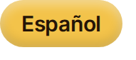

  

**Un agente de IA de código abierto que vive en tu Mac — y obedece a tu iPhone.** 
**Usa tu terminal y tus apps, y sigue trabajando mientras hablas.** 
**Todo lo que actúa en tu nombre espera *tu* clic.**

 

 

&nbsp;&nbsp;&nbsp;&nbsp;&nbsp;&nbsp;&nbsp;&nbsp;

&nbsp;&nbsp;&nbsp;&nbsp;&nbsp;

---

  
   
  Un trabajo en segundo plano, en directo en el notch: trabaja, <b>se detiene a preguntar</b> antes de mover tus archivos y luego te cuenta lo que encontró.

## Pídele cosas como

> *“Reúne las facturas de este año de Descargas en una carpeta y dime qué meses faltan.”* 
> *“¿Cuántos archivos duplicados hay en Descargas? Mueve las copias a la Papelera y conserva el más reciente.”* 
> *“Convierte sales_q3.csv en un informe de una página con un gráfico.”* 
> *“Crea una nota en Notas con los tres puntos de esta reunión.”* 
> *“Cada mañana a las 9, mira esta página y avísame si cambió el precio.”*

Sigues hablando mientras trabaja. Todo lo que borra, envía, instala o toca otra app **te pregunta primero** — en tu Mac o en tu iPhone.

## Empieza en un minuto

1. **[Descarga Arslan para macOS](https://github.com/mirzatghayrat/arslan/releases/latest/download/Arslan-macos-arm64.dmg)** (Apple Silicon, macOS 11+) — firmado, notarizado y se actualiza solo.
2. Arrástralo a **Aplicaciones** y ábrelo.
3. Pega una clave de API de modelo en Ajustes — OpenAI, Anthropic, Gemini, DeepSeek, Qwen, Kimi, OpenRouter y más — o conecta un modelo local con **Ollama**.

Y ya está. Sin cuenta, sin registro, sin servidor de Arslan.

## Novedades de 0.1.53 — Manos para tus apps del Mac

Arslan ahora puede leer y usar las apps de tu Mac — Notas, Mail, Pages y el resto — mediante un pequeño ayudante, **Arslan Hands**. Lee una ventana como su árbol de accesibilidad (nunca una captura) y actúa en segundo plano: tu ratón, tu teclado y tu ventana activa siguen siendo tuyos. Mirar una app pregunta una vez por app en cada conversación; actuar ocurre solo en trabajo en segundo plano y pregunta una vez por app; un botón que borra, envía, paga, compra, transfiere o confirma pregunta siempre. También llega la parte de Mac de **Arslan para iPhone** (Ajustes › iPhone), y el icono en blanco y negro es ahora el predeterminado. [Notas de la versión completas →](https://github.com/mirzatghayrat/arslan/releases/tag/v0.1.53)

  

Mac: de la película de lanzamiento de 0.1.52, interfaz reconstruida desde el código, escena preparada. iPhone: una grabación de pantalla real. <a href="https://aralem.dev/arslan/#film">▶ Todo el sistema en 60 segundos</a>

## Por qué Arslan

| | |
|---|---|
| **Un bucle, cada acción tras una puerta** | Un mensaje entra en un bucle nativo de llamadas a herramientas. El modelo propone; una función de política fija — no otro modelo — responde **run**, **ask** o **forbid** antes de cada comando de shell. Los resultados vuelven envueltos como datos no confiables, así que las instrucciones escondidas en una web se leen, no se obedecen. |
| **Sigue trabajando mientras hablas** | El trabajo largo se convierte en un trabajo en segundo plano y el turno termina. Un trabajo acaba **done**, **partial**, **blocked** o **stopped** — nunca en silencio. Las tareas programadas van como mucho cada 15 minutos (hasta 10), y lo que tu Mac se perdió dormido no se repite. |
| **El estado, en el notch** | La **Arslan Island** muestra lo que está haciendo, pregunta cuando te necesita y avisa cuando termina. Barra de menús, pulsar para hablar y un botón Stop para lo que esté en marcha. |
| **Manos: se pregunta, no se supone** | Apps del Mac con Arslan Hands, el navegador propio de Arslan, tus Atajos, AppleScript. Nunca escribe en un campo de contraseña y nunca toca Acceso a Llaveros, gestores de contraseñas, Ajustes del Sistema, avisos de seguridad de macOS, el Centro de notificaciones ni a sí mismo. |
| **Tu Mac en el bolsillo** | Arslan para iPhone (pronto en la App Store) habla con tu Mac a través de **tu propio iCloud privado**, cifrado de extremo a extremo. La misma tarjeta de aprobación aparece en ambos; gana la primera respuesta, y una tarjeta sin respuesta se rechaza a los 300 s. |
| **Local primero, con tu propia clave** | La memoria vive en SQLite en tu Mac; tu proveedor de modelos solo ve los turnos que envías, con tu clave. **Arslan no tiene servidores.** Corrígelo una vez y recordará la práctica — con Deshacer. |
|  **Tus credenciales siguen siendo tuyas** | Arslan nunca obtiene ni inyecta las credenciales de tus cuentas. Las conexiones autenticadas (App Store Connect y similares) siguen desactivadas hasta que un intermediario de credenciales aislado supere la revisión de seguridad — ver [W11](docs/companion/W11-security-boundary.md). Un comando que apruebas fuera del sandbox se ejecuta con tus propios permisos. |

## Un turno, de principio a fin

  

| Paso | Qué pasa | Dónde se aplica |
|---|---|---|
| **Mensaje** | Desde la ventana, tu iPhone o tu voz — una conversación, un bucle | `server/orchestrator/arslan.py`, `server/services/phone_bridge.py` |
| **Bucle** | Llamadas nativas a herramientas; el plan lo guarda el host; una respuesta cortada continúa en vez de adivinar; 75 s por llamada al modelo | `server/orchestrator/tool_loop.py` |
| **Política** | `run` · `ask` · `forbid`, una función pura del texto del comando | `server/services/terminal_policy.py` (detección de comandos destructivos tomada de Hermes Agent, MIT) |
| **Sandbox** | Seatbelt de macOS: los comandos solo escriben en la carpeta de trabajo, temporales y cachés; claves SSH, llavero y datos de Arslan quedan cerrados; las claves del modelo nunca llegan a un comando; 20 s por llamada a herramienta | `server/services/command_sandbox.py`, `terminal_exec.py` |
| **Resultado** | Envuelto como no confiable y revisado antes de llegarte; un guardián determinista detecta afirmaciones de trabajo que nunca se hizo | `server/orchestrator/untrusted.py`, `promise_guard.py` |

## La puerta

  

| Respuesta | Cuándo | Ejemplos (cada uno es la respuesta real de `terminal_policy.assess()`) |
|---|---|---|
| **run** | Leer, listar, convertir, compilar, descargar una página | `ls -la ~/Downloads` · `ffmpeg -i talk.mov talk.mp4` · `npm run build` · `curl -s https://example.com` |
| **ask** | Destructivo, o actuar hacia fuera en tu nombre | `rm -rf build/` · `git push --force` · `curl … \| sh` · `osascript …` · `brew install jq` · `mail -s …` · `scp … mac-mini:` |
| **forbid** | Nunca, ni con «no volver a preguntar» | `security find-generic-password … -w` · `cat ~/.arslan/secret_key` · `rm -rf ~` · `sudo …` · `shutdown` |

«No volver a preguntar» se recuerda por tipo de comando y aparece en Ajustes › Avanzado; las reglas forbid nunca se pueden recordar. La puerta protege de errores e instrucciones coladas — no es una jaula: un comando que permites se ejecuta con tus permisos. Prueba 64 comandos en el [sitio del proyecto](https://aralem.dev/arslan/#gate).

## Manos, trabajo en segundo plano y el iPhone

  

  

El enlace con el iPhone no tiene servidor de Arslan ni relé: los mensajes viajan por una zona de CloudKit en tu base de datos privada de iCloud — acuerdo de claves X25519, HKDF-SHA256, ChaCha20-Poly1305, firmas Ed25519. Los mensajes entregados se borran; lo que quede lo borra Arslan para Mac cuando tiene más de 7 días — el Mac lo comprueba aproximadamente una vez al día mientras está encendido y en línea, y si no, más tarde.

## Privacidad

  

## Instalación

Desde el código o con Docker (colaboradores y autoalojamiento): consulta **[docs/QUICKSTART.md](docs/QUICKSTART.md)**.

Reconocimiento de texto en imágenes y PDF escaneados, la postura de seguridad completa, variables de entorno y copias de seguridad: consulta el [README en inglés](README.md#install) (la versión en inglés es la de referencia).

## Estado — honestos sobre lo comprobado

- **Pre-v1.** Por ahora solo macOS 11+ en Apple Silicon. Los sandboxes son seatbelt de macOS; en otras plataformas el Python generado se rechaza y los comandos de shell se ejecutan sin sandbox, indicándolo.
- **Tu propia clave de modelo.** Arslan funciona con tu cuenta; te factura tu proveedor. El transporte nativo de herramientas está implementado y probado a nivel de protocolo para rutas compatibles con OpenAI, Anthropic y Gemini — no es una certificación en vivo de cada modelo o endpoint.
- **Hands solo ve ventanas del escritorio actual**; una app en otro Space o detrás de una app a pantalla completa cuenta como no abierta. Una ventana grande (Notas con muchas notas) puede tardar 10–20 segundos en leerse.
- **Arslan para iPhone llega pronto a la App Store.** La parte de Mac está en 0.1.53.
- **Lo que gasta según su propio horario viene apagado.** La curación de memoria en segundo plano solo llama a tu modelo si la activas en Ajustes › Automatización; aun así, pon un límite duro en la facturación de tu proveedor.
- Las API, esquemas y valores predeterminados pueden cambiar antes de v1.

## Comunidad

- ¿Un error o una idea? [Abre un issue](https://github.com/mirzatghayrat/arslan/issues).
- ¿Quieres ayudar? Empieza por [CONTRIBUTING.md](CONTRIBUTING.md).
- El sitio del proyecto está en [`docs/index.html`](docs/index.html) (GitHub Pages). Las imágenes de este README son capturas de ese sitio.

## Licencia

Apache-2.0. Consulta [LICENSE](LICENSE) y [NOTICE](NOTICE). Los avisos de terceros — incluidos Hermes Agent (MIT) y agent-desktop (Apache-2.0, incluido sin modificar en Arslan Hands) — están en [THIRD_PARTY_NOTICES.md](THIRD_PARTY_NOTICES.md). Iconos: [Lucide](https://lucide.dev) (ISC).

---

Si Arslan te resuena, <a href="https://github.com/mirzatghayrat/arslan/stargazers">una  ayuda a que otros lo encuentren</a>.

