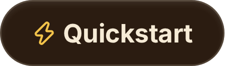
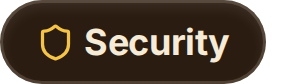
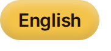

  

**An open-source AI agent that lives on your Mac — and answers to your iPhone.** 
**It runs your terminal, uses your apps and keeps working while you talk.** 
**Anything that acts in your name waits for *your* click.**

 

 

&nbsp;&nbsp;&nbsp;&nbsp;&nbsp;&nbsp;&nbsp;&nbsp;

<a href="https://aralem.dev/arslan/docs/"><b>📖 Technical docs</b></a> (Chinese for now)

&nbsp;&nbsp;&nbsp;&nbsp;&nbsp;

---

  
   
  A background job, live in the notch: it works, <b>stops to ask</b> before it moves your files, then tells you what it found.

## Try asking it

> *“Gather this year's invoices from Downloads into one folder, and tell me which months are missing.”* 
> *“How many duplicate files are in Downloads? Move the copies to the Trash, keep the newest.”* 
> *“Turn sales_q3.csv into a one-page report with a chart.”* 
> *“Make a note in Notes with the three points from this meeting.”* 
> *“Every morning at 9, check this page and tell me if the price changed.”*

You keep talking while it works. Anything that deletes, sends, installs or touches another app **asks you first** — on your Mac or your iPhone.

## Get started in a minute

1. **[Download Arslan for macOS](https://github.com/mirzatghayrat/arslan/releases/latest/download/Arslan-macos-arm64.dmg)** (Apple Silicon, macOS 11+) — signed, notarized, updates itself.
2. Drag it into **Applications** and open it.
3. Paste a model API key in Settings — OpenAI, Anthropic, Gemini, DeepSeek, Qwen, Kimi, OpenRouter and more — or point it at a local model through **Ollama**.

That's it. No account, no sign-up, no Arslan server.

## What's new in 0.1.53 — Hands for your Mac apps

Arslan can now read and use the apps on your Mac — Notes, Mail, Pages and the rest — through a small helper, **Arslan Hands**. It reads a window as its accessibility tree (never a screenshot) and acts in the background: your mouse, keyboard and front window stay yours. Looking at an app asks once per app in a conversation; acting happens only in background work and asks once per app; a button that deletes, sends, pays, buys, transfers or submits asks every time. The Mac side of **Arslan for iPhone** is in too (Settings › iPhone), and the black-and-white icon is now the default. [Full release notes →](https://github.com/mirzatghayrat/arslan/releases/tag/v0.1.53)

  

Mac: from the 0.1.52 launch film, interface rebuilt from source, scenario staged. iPhone: a real screen recording. <a href="https://aralem.dev/arslan/#film">▶ The whole system in 60 seconds</a>

## Why Arslan

| | |
|---|---|
| **One loop, every action behind a gate** | A message enters one native tool-calling loop. The model proposes; a fixed policy function — not another model — answers **run**, **ask** or **forbid** for every shell command before it runs. Results come back wrapped as untrusted data, so instructions hidden in a web page are read, not obeyed. |
| **It keeps working while you talk** | Long work becomes a background job and the turn ends. A job ends **done**, **partial**, **blocked** or **stopped** — never silently. Schedules run at most every 15 minutes (up to 10), and a schedule your Mac slept through is not replayed. |
| **Status in the notch** | The **Arslan Island** shows what it's doing, asks when it needs you, and tells you when it's done. Menu bar, push-to-talk, and a Stop button for anything in flight. |
| **Hands, asked not assumed** | Mac apps through Arslan Hands, Arslan's own browser, your Shortcuts, AppleScript. It never types into a password field, and never touches Keychain Access, password managers, System Settings, macOS security prompts, Notification Center or itself. |
| **Your Mac in your pocket** | Arslan for iPhone (coming to the App Store) talks to your Mac through **your own private iCloud**, end-to-end encrypted. The same approval card shows on both; the first answer wins, and an unanswered card is declined after 300 s. |
| **Local-first, bring your own key** | Memory lives in SQLite on your Mac; your model provider sees only the turns you send, on your key. **Arslan runs no servers.** Correct it once and it remembers the practice — with Undo. |
|  **Credentials stay yours** | Arslan never fetches or injects your account credentials. Authenticated connectors (App Store Connect and the like) remain disabled until an isolated credential broker passes security review — see [W11](docs/companion/W11-security-boundary.md). A command you approve outside the sandbox runs with your own permissions. |

## One turn, end to end

  

| Step | What happens | Enforced in |
|---|---|---|
| **Message** | From the window, your iPhone or your voice — one conversation, one loop | `server/orchestrator/arslan.py`, `server/services/phone_bridge.py` |
| **Loop** | Native tool calls; the plan is kept by the host; a cut-off reply continues instead of guessing; 75 s per model call | `server/orchestrator/tool_loop.py` |
| **Policy** | `run` · `ask` · `forbid`, a pure function of the command text | `server/services/terminal_policy.py` (destructive-command detection vendored from Hermes Agent, MIT) |
| **Sandbox** | macOS seatbelt: commands write only to the working folder, temp and caches; SSH keys, keychain and Arslan's data stay closed; model keys never reach a command; 20 s per tool call | `server/services/command_sandbox.py`, `terminal_exec.py` |
| **Result** | Wrapped as untrusted data and checked before it reaches you; claims of work that never ran are caught by a deterministic guard | `server/orchestrator/untrusted.py`, `promise_guard.py` |

## The gate

  

| Answer | When | Examples (each is `terminal_policy.assess()`'s real answer) |
|---|---|---|
| **run** | Reading, listing, converting, building, fetching a page | `ls -la ~/Downloads` · `ffmpeg -i talk.mov talk.mp4` · `npm run build` · `curl -s https://example.com` |
| **ask** | Destructive, or acting outward in your name | `rm -rf build/` · `git push --force` · `curl … \| sh` · `osascript …` · `brew install jq` · `mail -s …` · `scp … mac-mini:` |
| **forbid** | Never, even with “don't ask again” | `security find-generic-password … -w` · `cat ~/.arslan/secret_key` · `rm -rf ~` · `sudo …` · `shutdown` |

“Don't ask again” is remembered per kind of command and listed in Settings › Advanced; forbidden rules can never be remembered. The gate guards against mistakes and smuggled instructions — it is not a cage: a command you allow runs with your permissions. Try 64 commands on the [project site](https://aralem.dev/arslan/#gate).

## Hands, background work and the iPhone

  

  

The iPhone link has no Arslan server and no relay: messages travel through a CloudKit zone in your private iCloud database — X25519 key agreement, HKDF-SHA256, ChaCha20-Poly1305, Ed25519 signatures. Delivered messages are deleted; anything left over is deleted by Arslan for Mac once it is more than 7 days old — the Mac checks about once a day while it is running and online, and catches up when it is back.

## Privacy

  

## Install

The desktop app is the way to use Arslan — see [Get started in a minute](#get-started-in-a-minute). Running from source or with Docker (contributors & self-hosters): see **[docs/QUICKSTART.md](docs/QUICKSTART.md)**.

### Reading text in images and scanned PDFs

Mixed PDFs with native-text pages and separate scanned pages retain the native
text and original page numbers. Pages with drawing content but no text layer
are read with local OCR, within the page budget; unread pages are identified and
chat attachments are marked as partially read. Pages containing both native
text and image resources also receive a bounded local OCR pass. Original text
is retained separately from whole-page OCR, which may repeat some native text;
Arslan does not guess which near-matching passages to delete. Local OCR
availability and language support still depend on the host as described below.

A model with vision reads your pictures directly. When the model you configured
cannot — many cheaper models cannot — Arslan falls back to the operating
system's own text recognition. What that gives you depends on the platform, so
here it is per platform rather than as a blanket "supports OCR":

| Platform | Text in images / scanned PDFs | What it needs |
|---|---|---|
| **macOS** (the `.dmg`) | ✅ Works out of the box | **Nothing.** It uses macOS's built-in Vision framework — no download, no Homebrew, nothing borrowed from your machine |
| **Windows** | Planned — the intent is the same capability through the OS | — |
| **Linux** (from source) | ❌ Not available by default | Install `tesseract` yourself and the optional `ocr` extra |

Two honest caveats:

- **Text is read in your interface language (plus English).** This is a real
  limitation, not a default: system text recognition only finds what it is
  asked to look for, and asking for more makes it *worse* — measured, widening
  the request from Chinese+English to all thirty supported languages loses the
  Chinese text entirely. So if your interface is in English and you feed a
  Chinese screenshot, the writing is not read, and Arslan tells you which
  language it looked for rather than claiming the image was blank. Switch the
  interface language to read that image.
- **The available languages are whatever your macOS recognises**, and that set
  grows with the OS version — Arslan asks the system at runtime instead of
  promising a list. If your language is not among them, Arslan says so and
  reads nothing, rather than returning plausible-looking nonsense. **Uyghur is
  not supported by macOS text recognition**; we verified that asking anyway
  produces convincing gibberish, which is why Arslan refuses instead.
- Verified on macOS 26. **On macOS 11 and 12 the recognised-language set is
  smaller and has not been tested by us**; the runtime check means you will be
  told, not silently given wrong text.

## Security posture

  <a href="docs/companion/W11-security-boundary.md">W11 — Security boundary / verification limits</a>

Arslan is **safe by default**:

- **Localhost-only by default.** Dev + localhost runs unauthenticated on purpose (local convenience). Cross-site drive-by requests are blocked by TrustedHost + CORS + WebSocket-Origin checks; non-localhost / prod deploys must set the allowlists below.
- **Tokens where they matter.** `prod`, packaged builds, and non-loopback binds require a bearer token — auto-generated, persisted, and rotatable from Settings so you can't lock yourself out.
- **Secrets refuse the public key.** BYOK secrets are Fernet-encrypted with a PBKDF2-HMAC-SHA256 key derived from `ARSLAN_SECRET_KEY` over a per-install salt; the app refuses to write secrets under the built-in public dev key.
- **Two sandboxes, two rules.** Generated Python (`run_python`) runs under a default-deny macOS `sandbox-exec` profile with the network denied and a scrubbed environment, and is refused where that isolation is unavailable. Shell commands (`run_command`) run under seatbelt that limits **writes** to the working folder, temp and caches and closes SSH keys, keychain files and Arslan's own data — the network stays open there, because Arslan reads the web with it. Running a command outside the sandbox always takes your click. Where seatbelt itself cannot start, a shell command still runs and its result says `sandbox="unavailable"`; only the wrap-up step, which must stay offline, refuses instead.
- **Hands holds no permission itself.** Accessibility is granted to the separate **Arslan Hands** helper, never to Arslan; it accepts only the signed Arslan backend as its peer.

**Do not expose the server to an untrusted network without a token and host/origin allowlists.** Full threat model and reporting policy: [SECURITY.md](SECURITY.md).

<b>Environment variables (full reference)</b>

 

| Env var | Default | Purpose |
| --- | --- | --- |
| `ARSLAN_SECRET_KEY` | *(auto-generated in dev)* | Derives the Fernet key that encrypts stored BYOK secrets at rest. Dev: unset → auto-generated on the first boot, persisted to `~/.arslan/secret_key`, and reused thereafter; an explicit value always wins (a mismatch vs the persisted file logs a warning). In `prod` a missing value is boot-fatal and the persisted dev file is **never** read. |
| `ARSLAN_SECRET_KEY_FILE` | `~/.arslan/secret_key` | Dev-only: where the auto-generated secret persists — kept **outside** the data dir on purpose (backup = data dir **+** this file). Set **empty** to disable auto-generation entirely. Ignored in `prod`. Any dev entry point that loads server config (server, migration CLI, diagnostics) may mint it on first use; generation always prints one line saying where. |
| `ARSLAN_API_TOKEN` | *(empty)* | API/WS bearer token. **Empty in dev + localhost = no auth** (zero-friction local). For prod / packaged / non-loopback binds a token is auto-generated on first run (see below). |
| `ARSLAN_DATA_DIR` | platform app-data dir | Where the DB, notes, and secrets live. Unset → macOS `~/Library/Application Support/Arslan`, Linux `~/.local/share/Arslan`, Windows `%APPDATA%/Arslan`. **This directory plus your secret are the backup unit** (see [Data & backup](#data--backup)). |
| `ARSLAN_ENV` | `dev` | `dev` or `prod`. `prod` requires a token and hardens defaults; a missing `ARSLAN_SECRET_KEY` in `prod` is boot-fatal. |
| `ARSLAN_ALLOWED_HOSTS` | localhost only | Comma-separated TrustedHost allowlist for non-localhost / prod deploys. |
| `ARSLAN_ALLOWED_ORIGINS` | localhost only | Comma-separated CORS + WebSocket-Origin allowlist for non-localhost / prod deploys. |
| `ARSLAN_ALLOW_INSECURE_SECRETS` | *(off)* | Dev-only escape hatch: permits writing secrets under the public default key. **Never use for real keys.** |
| `ARSLAN_ALLOW_UNSANDBOXED_PY` | *(off)* | Dev-only escape hatch: lets generated Python run **without** a sandbox where none is available. Arbitrary code then runs with the server's privileges and network access; runs are marked `sandboxed=false` for audit. Only enable on a machine you fully trust. |

For prod / packaged (`ARSLAN_PACKAGED=1`) / non-loopback binds, if `ARSLAN_API_TOKEN` is empty the app **auto-generates** a token on first run, persists it to `<data_dir>/api_token` (owner-only), prints it once at boot, and lets you view/reset it in Settings.

<b>Data &amp; backup</b>

 

The database, notes, encrypted provider credentials and durable outputs live under `ARSLAN_DATA_DIR` (unless paths were explicitly overridden). The per-install encryption salt is **inside the database**, not a separate active `crypto_salt` file. Stop Arslan before backup; use the checksummed backup/restore commands in [Recovery and execution contracts](docs/RELIABILITY.md). Restore targets a new directory and never overwrites the running app's data. Keep your encryption secret separately; access tokens can be re-created.

One deliberate exception: the secret itself lives **outside** that directory. If you never set `ARSLAN_SECRET_KEY` yourself, the dev auto-generated value sits at `~/.arslan/secret_key` — so a copied data dir alone can't decrypt your stored provider keys (lock and box travel separately). A complete backup is therefore **two pieces**: the data dir **and** the secret (your env value or that file).

## Status — honest about what's proven

**Pre-v1.** We'd rather under-claim than over-sell:

- **macOS 11+ on Apple Silicon only, for now.** The sandboxes are macOS seatbelt; elsewhere generated Python is refused and shell commands run unsandboxed, marked as such.
- **Bring your own model key.** Arslan runs against your account; your provider bills you. Native tool transport is implemented and wire-tested for OpenAI-compatible, Anthropic and Gemini paths — that is not live certification of every model or endpoint.
- **Hands sees windows on the current desktop only**; an app on another Space or behind a full-screen app counts as not open. A large window (Notes with many notes) can take 10–20 seconds to read.
- **Arslan for iPhone is coming to the App Store.** The Mac side ships in 0.1.53.
- **Anything that spends on its own schedule ships off.** Background memory curation calls your model when you turn it on in Settings › Automation; keep a hard limit in your provider's billing dashboard.
- APIs, schemas and defaults may change before v1.

## Community

-  Found a bug or have an idea? [Open an issue](https://github.com/mirzatghayrat/arslan/issues).
-  Want to help? Start with [CONTRIBUTING.md](CONTRIBUTING.md).
-  The project site lives in [`docs/index.html`](docs/index.html) (served via GitHub Pages). The images in this README are captures of that site.

## License

Apache-2.0. See [LICENSE](LICENSE) and [NOTICE](NOTICE). Third-party dependency notices are in [THIRD_PARTY_NOTICES.md](THIRD_PARTY_NOTICES.md). Icons: [Lucide](https://lucide.dev) (ISC).
## License

Apache-2.0. See [LICENSE](LICENSE) and [NOTICE](NOTICE). Third-party notices — including Hermes Agent (MIT) and agent-desktop (Apache-2.0, shipped unmodified inside Arslan Hands) — are in [THIRD_PARTY_NOTICES.md](THIRD_PARTY_NOTICES.md). Icons: [Lucide](https://lucide.dev) (ISC).

---

If Arslan resonates with you, <a href="https://github.com/mirzatghayrat/arslan/stargazers">a  helps other people find it</a>.

