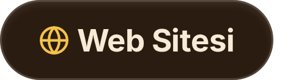
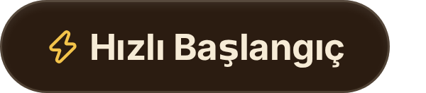
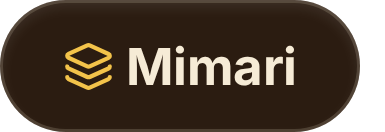
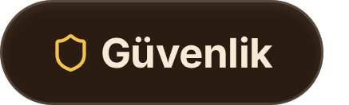
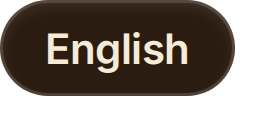
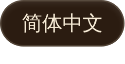
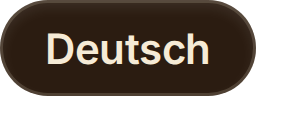
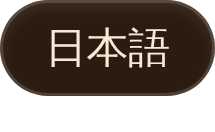
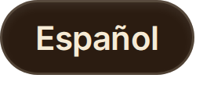
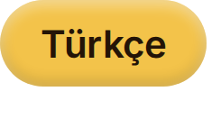

  

**Tek bir ana ajanla (host agent) konuşursun. O, işi kendi yetiştirdiğin persona spawn'larına (uzmanlaşmış alt ajanlar) yönlendirir.** 
**Prompt'ları kendi kendine gelişir — ama her değişiklik bir held-out sınavından geçer** 
**ve *sen* Promote'a basana kadar hiçbir şey devreye girmez.**

 

 

&nbsp;&nbsp;&nbsp;&nbsp;&nbsp;&nbsp;&nbsp;&nbsp;&nbsp;&nbsp;

&nbsp;&nbsp;&nbsp;&nbsp;&nbsp;

---

## Tek istek, uçtan uca

  

<em>Bir kez sorarsın. Ana ajan (host agent) spawn'ı seçer, işi böler, üretilen kodu bir çekirdek sandbox'ında çalıştırır ve yanıtlar — hepsi tek bir thread'de.</em>

<a href="docs/assets/arslan-clay-60s.mp4"><b>▶ 60 saniyelik filmi izleyin</b></a> — <a href="https://mirzatghayrat.github.io/arslan/">proje sitesinin</a> kesildiği kil animasyon filminin ta kendisi.  Yukarıdaki ekranlar yayınlanan istemcinin kendisi, rötuşsuz.

**Arslan, yerel öncelikli (local-first) kişisel bir yapay zeka orkestratörüdür.** Kendi makinende, kendi LLM anahtarlarınla çalışır; **varsayılan olarak güvenli bir çekirdek sandbox'ı**, **dürüstlük korkulukları** ve göz atıp düzenleyebileceğin **görünür bir ikinci beyin** ile birlikte gelir.

## Neden Arslan

| | |
|---|---|
|  **Kendin büyüttüğün bir persona ekibi** | Arslan ön kapıdır; arkasında uzman spawn'lardan oluşan bir kadro kurarsın — onları araçlarla, `SKILL.md` yetenek paketleriyle ve MCP sunucularıyla donatır, sonra iki katmanlı bir evrim döngüsünün onları zamanla incelmesine bırakırsın. |
|  **Sınav kapılı kendi kendine evrim** | Bir spawn'ın prompt'u, kendi çalışma geçmişinden yola çıkarak kendini revize eder — sonra held-out geçmiş görevlerde, hem de *her* boyutta, mevcut sürümü geçmek zorundadır. Geçerse → okunabilir bir diff gelen kutuna düşer. **Sen Promote'a basana kadar hiçbir şey devreye girmez.** |
|  **Varsayılan olarak güvenli, sorumluluk reddiyle değil** | Üretilen kod, çekirdek tarafından uygulanan bir sandbox (macOS seatbelt) altında ağa kapalı çalışır. Kimlik bilgisi enjekte eden bir proxy, sandbox'taki git'in ağla konuşmasını sağlar; ham token'lar ise sandbox'a asla girmez. Çekirdek sandbox'ının bulunmadığı yerde sistem **kapalı konuma düşer (fails closed)**. |
|  **Zaman ekseni olan bir ikinci beyin** | Materyaller, öğrenimler, bir profil ve `[[wiki-link]]` notları — hibrit FTS5 + embedding erişimi, Obsidian tarzı kuvvet yönlendirmeli bir grafik olarak gezilebilir. İnançlar zaman taşır: her biri ne zaman doğru oldu, yerini ne aldı — artı grafiği geçmişteki herhangi bir anda durduğu haliyle gösteren bir filtre. |
|  **Tasarım gereği dürüst** | Korkuluklar, uydurma "Bunu zaten yaptım" iddialarını yakalar ve ajanın kendi raporlamasını gerçekten çalışan şeylere bağlı tutar. Modelin önerdiği bellek silme/üzerine yazma işlemleri asla doğrudan uygulanmaz — kabul ya da reddedebileceğin bir gelen kutusuna düşer. |
|  **Yerel öncelikli, kendi anahtarını getir** | Senin makinen, senin API anahtarların, birden çok sağlayıcı arasında kalite öncelikli yönlendirme — ve arada **sıfır üçüncü taraf sunucu**. 6 dilde i18n ve 6 tema paletiyle (açık + koyu) birlikte gelir. |

Backend: FastAPI + async SQLAlchemy/SQLite (`server/`) · Frontend: React 19 + TypeScript + Vite (`web/`) · İzleme (tracing), LLM-jüri değerlendirmeleri ve Grafana tarzı bir tanı panosu evrim döngüsünü besler.

## Gerçek istemcinin içinden

  

## Bir istek nasıl akar

  

## Denetimli kendi kendine evrim

  

Bir spawn'ın prompt'u otomatik olarak revize edilir — ama sen onu görmeden önce held-out geçmiş görevlerde kendini kanıtlamak zorundadır. Hiçbir boyutun mevcut sürümden daha kötü puan almasına izin verilmez. Başarısız → atılır, asla karşına çıkmaz. Geçerse → okunabilir bir diff içeren bir öneri kartı; değişiklik **yalnızca sen Promote'a tıkladığında** devreye girer.

## Zaman ekseni olan bir ikinci beyin

  

Bellek kendiliğinden oluşur — yönlendiricinin çıkardığı gerçekler ve oturum sonu damıtma — ve spawn'lar onu hibrit FTS5 + embedding erişimiyle geri okur. Her inanç, ne zaman yürürlüğe girdiğini ve yerini neyin aldığını kaydeder; böylece Obsidian tarzı grafiği geçmişteki herhangi bir ana kaydırabilirsin. Model bir belleği düzenlemek ya da silmek istediğinde, öneri önce senin gelen kutuna düşer — **hiçbir şeyin üzerine sessizce yazılmaz**.

## Kurulum

**Arslan'ı kullanmanın yolu masaüstü uygulamasıdır** — imzalı, noter onaylı ve kendini güncel tutar:

<a href="https://github.com/mirzatghayrat/arslan/releases/latest/download/Arslan-macos-arm64.dmg"><b>⬇ macOS için Arslan'ı indir</b></a> (Apple Silicon) — DMG'yi aç ve Arslan'ı <b>Applications</b> klasörüne sürükle.

İlk çalıştırmada Ayarlar'dan model API anahtarını ekle, hepsi bu.

Kaynaktan çalıştırma veya Docker (katkıda bulunanlar / self-host): bkz. **[docs/QUICKSTART.md](docs/QUICKSTART.md)**.

## Güvenlik duruşu

  

Arslan **varsayılan olarak güvenlidir**:

- **Varsayılan olarak yalnızca localhost.** Dev + localhost bilerek kimlik doğrulamasız çalışır (yerel kolaylık). Siteler arası drive-by istekleri TrustedHost + CORS + WebSocket-Origin kontrolleriyle engellenir; localhost dışı / prod dağıtımlar aşağıdaki izin listelerini ayarlamak zorundadır.
- **Token'lar tam da önemli oldukları yerde.** `prod`, paketlenmiş derlemeler ve loopback dışı bağlamalar bir bearer token gerektirir — otomatik üretilir, kalıcı saklanır ve kendini dışarıda kilitleyemeyesin diye Ayarlar'dan döndürülebilir.
- **Sırlar herkese açık anahtarı reddeder.** BYOK sırları, kuruluma özel bir salt üzerinden `ARSLAN_SECRET_KEY`'den türetilen bir PBKDF2-HMAC-SHA256 anahtarıyla Fernet şifrelenir; uygulama, yerleşik herkese açık dev anahtarı altında sır yazmayı reddeder.
- **Sandbox kapalı konuma düşer.** Üretilen kod, macOS seatbelt altında ağa kapalı çalışır; çekirdek sandbox'ının bulunmadığı yerde sessizce sandbox'sız çalışmak yerine kapalı konuma düşer.

**Sunucuyu, token ve host/origin izin listeleri olmadan güvenmediğin bir ağa açma.** Tam tehdit modeli ve bildirim politikası: [SECURITY.md](SECURITY.md).

<b>Ortam değişkenleri (tam referans)</b>

 

| Ortam değişkeni | Varsayılan | Amaç |
| --- | --- | --- |
| `ARSLAN_SECRET_KEY` | *(dev'de otomatik üretilir)* | Saklanan BYOK sırlarını beklemede (at rest) şifreleyen Fernet anahtarını türetir. Dev: ayarlanmamışsa → ilk açılışta otomatik üretilir, `~/.arslan/secret_key` dosyasına kalıcı yazılır ve sonrasında yeniden kullanılır; açıkça verilen bir değer her zaman kazanır (kalıcı dosyayla uyuşmazlık bir uyarı loglar). `prod`'da eksik değer açılışı durdurur ve kalıcı dev dosyası **asla** okunmaz. |
| `ARSLAN_SECRET_KEY_FILE` | `~/.arslan/secret_key` | Yalnızca dev: otomatik üretilen sırrın kalıcı olarak durduğu yer — bilerek veri dizininin **dışında** tutulur (yedek = veri dizini **+** bu dosya). Otomatik üretimi tamamen kapatmak için **boş** bırakarak ayarla. `prod`'da yok sayılır. Sunucu yapılandırmasını yükleyen herhangi bir dev giriş noktası (sunucu, migrasyon CLI'ı, tanılama) onu ilk kullanımda üretebilir; üretim her zaman nereye yazıldığını söyleyen tek bir satır basar. |
| `ARSLAN_API_TOKEN` | *(boş)* | API/WS bearer token'ı. **Dev + localhost'ta boş = kimlik doğrulama yok** (sıfır sürtünmeli yerel kullanım). Prod / paketlenmiş / loopback dışı bağlamalar için ilk çalıştırmada bir token otomatik üretilir (aşağıya bak). |
| `ARSLAN_DATA_DIR` | platform uygulama-verisi dizini | DB'nin, notların ve sırların yaşadığı yer. Ayarlanmamışsa → macOS `~/Library/Application Support/Arslan`, Linux `~/.local/share/Arslan`, Windows `%APPDATA%/Arslan`. **Bu dizin artı sırrın, yedekleme birimidir** (bkz. [Veri & yedekleme](#veri--yedekleme)). |
| `ARSLAN_ENV` | `dev` | `dev` ya da `prod`. `prod` bir token gerektirir ve varsayılanları sıkılaştırır; `prod`'da eksik bir `ARSLAN_SECRET_KEY` açılışı durdurur. |
| `ARSLAN_ALLOWED_HOSTS` | yalnızca localhost | Localhost dışı / prod dağıtımlar için virgülle ayrılmış TrustedHost izin listesi. |
| `ARSLAN_ALLOWED_ORIGINS` | yalnızca localhost | Localhost dışı / prod dağıtımlar için virgülle ayrılmış CORS + WebSocket-Origin izin listesi. |
| `ARSLAN_ALLOW_INSECURE_SECRETS` | *(kapalı)* | Yalnızca dev'e özel kaçış kapısı: sırların herkese açık varsayılan anahtar altında yazılmasına izin verir. **Gerçek anahtarlar için asla kullanma.** |
| `ARSLAN_ALLOW_UNSANDBOXED_PY` | *(kapalı)* | Yalnızca dev'e özel kaçış kapısı: sandbox'ın bulunmadığı yerde üretilen Python'un sandbox **olmadan** çalışmasına izin verir. Rastgele kod bu durumda sunucunun ayrıcalıkları ve ağ erişimiyle çalışır; çalıştırmalar denetim için `sandboxed=false` olarak işaretlenir. Yalnızca tamamen güvendiğin bir makinede etkinleştir. |

Prod / paketlenmiş (`ARSLAN_PACKAGED=1`) / loopback dışı bağlamalarda, `ARSLAN_API_TOKEN` boşsa uygulama ilk çalıştırmada bir token **otomatik üretir**, onu `<data_dir>/api_token` dosyasına (yalnızca-sahip erişimli) kalıcı yazar, açılışta bir kez ekrana basar ve Ayarlar'dan görüntüleyip sıfırlamana izin verir.

<b>Veri &amp; yedekleme</b>

 

Önemli olan her şey tek bir dizinde yaşar — DB, notların ve şifrelenmiş sırların — ve `ARSLAN_DATA_DIR`'den (ya da ayarlanmamışsa platform uygulama-verisi dizininden) çözümlenir. **O dizin yedekleme biriminin ta kendisidir:** Arslan'ı yedeklemek için onu kopyala, geri yüklemek için geri kopyala. `api_token` ve `crypto_salt` dosyalarını onunla birlikte tut — yeni şemayla (PBKDF2) şifrelenmiş sırlar `ARSLAN_SECRET_KEY` **ve** kuruluma özel `crypto_salt`'tan türetilir; dolayısıyla `crypto_salt`'ı kaybetmek (ya da uyuşmayanını kullanmak), elinde doğru `ARSLAN_SECRET_KEY` olsa bile saklanan bu sırları çözülemez kılar.

Bilinçli tek bir istisna var: sırrın kendisi o dizinin **dışında** yaşar. `ARSLAN_SECRET_KEY`'i hiç kendin ayarlamadıysan, dev'de otomatik üretilen değer `~/.arslan/secret_key` konumunda durur — böylece kopyalanan bir veri dizini tek başına saklanan sağlayıcı anahtarlarını çözemez (kilit ve kutu ayrı yolculuk eder). Eksiksiz bir yedek bu yüzden **iki parçadan** oluşur: veri dizini **ve** sır (env değerin ya da o dosya).

## Durum — kanıtlananlar konusunda dürüst

**v1 öncesi.** Abartılı satış yapmaktansa az iddia etmeyi tercih ederiz:

- **Önce macOS.** Çekirdek sandbox'ı yalnızca macOS seatbelt'tir; diğer platformlarda kapalı konuma düşer (Linux / Windows daha sonra bir Tauri masaüstü uygulamasıyla hedefleniyor).
- **Kendi kendine evrilen ajan ekibi sağlamlaştırılıyor.** İki katmanlı evrim döngüsü çalışıyor ama henüz tamamen kanıtlanmış olarak iddia edilmiyor — onu bitmiş değil, olgunlaşmakta olarak gör.
- **Ajan tabanlı bellek okuma/yazma, yerel araç çağırma (native tool-calling) yapan bir sağlayıcı gerektirir.** `recall`/`remember` araçları yalnızca gerçekten araç çağırma yapan sağlayıcılarda tetiklenir (ör. DeepSeek). Doğrudan bir Anthropic backend'i üzerinde asla tetiklenmezler — o yol bilerek metin-giriş/metin-çıkıştır, dolayısıyla araç şeması modele hiç gönderilmez. Bellek her iki durumda da, bu özellikten bağımsız olarak kendiliğinden oluşur (yönlendiricinin çıkardığı gerçekler + oturum sonu damıtma).
- **Para harcayan iki arka plan döngüsü kapalı olarak gelir.** Otomatik evrim ve uyku zamanı küratörlüğünün her biri LLM'i kendi programına göre çağırır; bu yüzden ikisi de varsayılan olarak kapalıdır — onları Ayarlar'dan açarsın. Henüz çalışan bir harcama sınırı yok: çalıştırma öncesi tahmin, korpusunla birlikte büyüyen bilinen bir aşırı tahmindir, dolayısıyla ona karşı hiçbir şey zorlanmaz. Bu düzeltilene kadar harcamayı sağlayıcının faturalama panosundaki katı bir limitle sınırla.
- API'ler, şemalar ve varsayılanlar v1'den önce değişebilir.

## Topluluk

-  Bir hata mı buldun, yoksa bir fikrin mi var? [Bir issue aç](https://github.com/mirzatghayrat/arslan/issues).
-  Yardım etmek mi istiyorsun? [CONTRIBUTING.md](CONTRIBUTING.md) ile başla.
-  Proje sitesi [`docs/index.html`](docs/index.html) içinde yaşar (GitHub Pages üzerinden sunulur). Bu README'deki blueprint figürleri elle çizilmiş SVG'lerdir — kaynakları [`docs/diagrams/`](docs/diagrams/) içinde.

## Lisans

Apache-2.0. Bkz. [LICENSE](LICENSE) ve [NOTICE](NOTICE). Üçüncü taraf bağımlılık bildirimleri [THIRD_PARTY_NOTICES.md](THIRD_PARTY_NOTICES.md) içinde. Simgeler: [Lucide](https://lucide.dev) (ISC).

---

Arslan sana bir şeyler söylediyse, <a href="https://github.com/mirzatghayrat/arslan/stargazers">bir  başkalarının da onu bulmasına yardım eder</a>.

