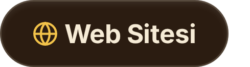
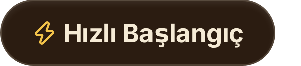
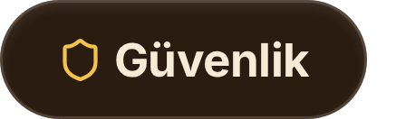
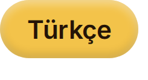

  

**Mac'inde yaşayan — ve iPhone'unu dinleyen — açık kaynaklı bir yapay zekâ ajanı.** 
**Terminalini ve uygulamalarını kullanır, sen konuşurken çalışmaya devam eder.** 
**Senin adına yapılan her şey *senin* tıklamanı bekler.**

 

 

&nbsp;&nbsp;&nbsp;&nbsp;&nbsp;&nbsp;&nbsp;&nbsp;

&nbsp;&nbsp;&nbsp;&nbsp;&nbsp;

---

  
   
  Çentikte canlı bir arka plan işi: çalışır, dosyalarını taşımadan önce <b>durup sorar</b>, sonra ne bulduğunu söyler.

## Ondan şunları isteyebilirsin

> *“Bu yılın faturalarını İndirilenler'den tek bir klasörde topla ve hangi ayların eksik olduğunu söyle.”* 
> *“İndirilenler'de kaç kopya dosya var? Kopyaları Çöp Sepeti'ne taşı, en yenisini tut.”* 
> *“sales_q3.csv dosyasını grafikli tek sayfalık bir rapora dönüştür.”* 
> *“Notlar'da bu toplantının üç maddesiyle bir not oluştur.”* 
> *“Her sabah 9'da bu sayfaya bak, fiyat değiştiyse bana söyle.”*

O çalışırken sen konuşmaya devam edersin. Silen, gönderen, kuran ya da başka bir uygulamaya dokunan her şey **önce sana sorar** — Mac'inde ya da iPhone'unda.

## Bir dakikada başla

1. **[macOS için Arslan'ı indir](https://github.com/mirzatghayrat/arslan/releases/latest/download/Arslan-macos-arm64.dmg)** (Apple Silicon, macOS 11+) — imzalı, noter onaylı, kendini günceller.
2. **Uygulamalar**'a sürükle ve aç.
3. Ayarlar'a bir model API anahtarı yapıştır — OpenAI, Anthropic, Gemini, DeepSeek, Qwen, Kimi, OpenRouter ve diğerleri — ya da **Ollama** ile yerel bir modele bağla.

Bu kadar. Hesap yok, kayıt yok, Arslan sunucusu yok.

## 0.1.53'te yeni — Mac uygulamaların için eller

Arslan artık küçük bir yardımcı olan **Arslan Hands** ile Mac'indeki uygulamaları — Notlar, Mail, Pages ve diğerleri — okuyup kullanabiliyor. Bir pencereyi erişilebilirlik ağacı olarak okur (asla ekran görüntüsü değil) ve arka planda çalışır: faren, klavyen ve öndeki pencere senin kalır. Bir uygulamaya bakmak her sohbette uygulama başına bir kez sorar; işlem yalnızca arka plan işinde olur ve uygulama başına bir kez sorar; silen, gönderen, ödeyen, satın alan, para aktaran ya da gönder'e basan bir düğme her seferinde sorar. **iPhone için Arslan**'ın Mac tarafı da geldi (Ayarlar › iPhone) ve siyah-beyaz simge artık varsayılan. [Tüm sürüm notları →](https://github.com/mirzatghayrat/arslan/releases/tag/v0.1.53)

  

Mac: 0.1.52 tanıtım filminden; arayüz kaynak koddan yeniden kuruldu, sahne kurgudur. iPhone: gerçek bir ekran kaydı. <a href="https://aralem.dev/arslan/#film">▶ Tüm sistem 60 saniyede</a>

## Neden Arslan

| | |
|---|---|
| **Tek döngü, her işlem bir kapının ardında** | Bir mesaj tek bir yerel araç çağırma döngüsüne girer. Model önerir; her kabuk komutu çalışmadan önce sabit bir politika fonksiyonu — başka bir model değil — **run**, **ask** ya da **forbid** der. Sonuçlar güvenilmez veri olarak sarılı döner; bir web sayfasına gizlenmiş talimatlar okunur, uygulanmaz. |
| **Sen konuşurken çalışmaya devam eder** | Uzun iş arka plan işine dönüşür ve tur biter. Bir iş **done**, **partial**, **blocked** ya da **stopped** ile biter — asla sessizce değil. Zamanlanmış görevler en sık 15 dakikada bir çalışır (en fazla 10) ve Mac uyurken kaçırılanlar sonradan tekrarlanmaz. |
| **Durum çentikte** | **Arslan Island** ne yaptığını gösterir, sana ihtiyaç olduğunda sorar ve bittiğinde haber verir. Menü çubuğu, bas-konuş ve süren her şey için bir Stop düğmesi. |
| **Eller — varsayılmaz, sorulur** | Arslan Hands ile Mac uygulamaları, Arslan'ın kendi tarayıcısı, Kestirmelerin, AppleScript. Asla bir parola alanına yazmaz; Anahtar Zinciri Erişimi'ne, parola yöneticilerine, Sistem Ayarları'na, macOS güvenlik istemlerine, Bildirim Merkezi'ne ve kendisine asla dokunmaz. |
| **Mac'in cebinde** | iPhone için Arslan (yakında App Store'da) Mac'inle **kendi özel iCloud'un** üzerinden, uçtan uca şifreli konuşur. Aynı onay kartı ikisinde de görünür; ilk cevap geçerlidir ve yanıtsız kalan bir kart 300 saniye sonra reddedilir. |
| **Önce yerel, kendi anahtarınla** | Bellek Mac'indeki SQLite'ta durur; model sağlayıcın yalnızca gönderdiğin turları, senin anahtarınla görür. **Arslan hiçbir sunucu çalıştırmaz.** Bir kez düzelt, o yöntemi hatırlar — Geri Al ile. |
|  **Kimlik bilgileri senin kalır** | Arslan hesap kimlik bilgilerini asla almaz ya da enjekte etmez. Kimlik doğrulamalı bağlayıcılar (App Store Connect gibi), yalıtılmış bir kimlik bilgisi aracısı güvenlik incelemesinden geçene kadar devre dışıdır — bkz. [W11](docs/companion/W11-security-boundary.md). Sandbox dışında çalıştırmayı onayladığın bir komut kendi yetkilerinle çalışır. |

## Bir tur, baştan sona

  

| Adım | Ne olur | Uygulandığı yer |
|---|---|---|
| **Mesaj** | Pencereden, iPhone'undan ya da sesinle — tek sohbet, tek döngü | `server/orchestrator/arslan.py`, `server/services/phone_bridge.py` |
| **Döngü** | Yerel araç çağrıları; planı ana süreç tutar; yarıda kesilen yanıt tahmin yerine devam eder; model çağrısı başına 75 sn | `server/orchestrator/tool_loop.py` |
| **Politika** | `run` · `ask` · `forbid`, komut metninin saf bir fonksiyonu | `server/services/terminal_policy.py` (yıkıcı komut algılama Hermes Agent'tan, MIT) |
| **Sanal alan** | macOS seatbelt: komutlar yalnızca çalışma klasörüne, geçici klasörlere ve önbelleklere yazar; SSH anahtarları, anahtar zinciri ve Arslan'ın verileri kapalı kalır; model anahtarları bir komuta asla ulaşmaz; araç çağrısı başına 20 sn | `server/services/command_sandbox.py`, `terminal_exec.py` |
| **Sonuç** | Güvenilmez veri olarak sarılır ve sana ulaşmadan kontrol edilir; hiç yapılmamış işle ilgili iddiaları deterministik bir koruma yakalar | `server/orchestrator/untrusted.py`, `promise_guard.py` |

## Kapı

  

| Cevap | Ne zaman | Örnekler (her biri `terminal_policy.assess()`'in gerçek cevabı) |
|---|---|---|
| **run** | Okuma, listeleme, dönüştürme, derleme, bir sayfa çekme | `ls -la ~/Downloads` · `ffmpeg -i talk.mov talk.mp4` · `npm run build` · `curl -s https://example.com` |
| **ask** | Yıkıcı ya da senin adına dışarıya dönük | `rm -rf build/` · `git push --force` · `curl … \| sh` · `osascript …` · `brew install jq` · `mail -s …` · `scp … mac-mini:` |
| **forbid** | Asla, “bir daha sorma” ile bile | `security find-generic-password … -w` · `cat ~/.arslan/secret_key` · `rm -rf ~` · `sudo …` · `shutdown` |

“Bir daha sorma” komut türüne göre hatırlanır ve Ayarlar › Gelişmiş'te listelenir; forbid kuralları asla hatırlanamaz. Kapı hatalara ve araya sızdırılmış talimatlara karşı korur — kafes değildir: izin verdiğin bir komut senin yetkilerinle çalışır. 64 komutu [proje sitesinde](https://aralem.dev/arslan/#gate) dene.

## Eller, arka plan işleri ve iPhone

  

  

iPhone bağlantısında Arslan sunucusu ya da aktarıcı yoktur: mesajlar özel iCloud veritabanındaki bir CloudKit bölgesinden geçer — X25519 anahtar anlaşması, HKDF-SHA256, ChaCha20-Poly1305, Ed25519 imzaları. Teslim edilen mesajlar silinir; geride kalanları Arslan for Mac 7 günden eski olduklarında siler — Mac açık ve çevrimiçiyken yaklaşık günde bir kez kontrol eder, değilse daha sonra.

## Gizlilik

  

## Kurulum

Kaynak koddan ya da Docker ile çalıştırmak için (katkıda bulunanlar ve kendi sunucusunda barındıranlar): **[docs/QUICKSTART.md](docs/QUICKSTART.md)**.

Görsellerde ve taranmış PDF'lerde metin tanıma, güvenlik duruşunun tamamı, ortam değişkenleri ve veri yedekleme için [İngilizce README](README.md#install)'ye bak (esas olan İngilizce sürümdür).

## Durum — kanıtlanana dair dürüst

- **Pre-v1.** Şimdilik yalnızca Apple Silicon'da macOS 11+. Sanal alanlar macOS seatbelt'tir; diğer platformlarda güvenli biçimde reddedilir.
- **Kendi model anahtarın.** Arslan senin hesabınla çalışır; faturayı sağlayıcın keser. Yerel araç taşıma OpenAI uyumlu, Anthropic ve Gemini yolları için uygulanmış ve protokol düzeyinde test edilmiştir — bu her model ya da uç noktanın canlı sertifikası değildir.
- **Hands yalnızca geçerli masaüstündeki pencereleri görür**; başka bir Space'teki ya da tam ekran bir uygulamanın arkasındaki uygulama açık sayılmaz. Büyük bir pencerenin (çok notlu Notlar) okunması 10–20 saniye sürebilir.
- **iPhone için Arslan yakında App Store'da.** Mac tarafı 0.1.53 ile geldi.
- **Kendi takvimine göre para harcayan her şey kapalı gelir.** Arka plan bellek düzenleme, yalnızca Ayarlar › Otomasyon'da açarsan modelini çağırır; yine de sağlayıcının fatura panelinde kesin bir sınır koy.
- API'ler, şemalar ve varsayılanlar v1'den önce değişebilir.

## Topluluk

- Bir hata mı buldun ya da bir fikrin mi var? [Issue aç](https://github.com/mirzatghayrat/arslan/issues).
- Yardım etmek mi istiyorsun? [CONTRIBUTING.md](CONTRIBUTING.md) ile başla.
- Proje sitesi [`docs/index.html`](docs/index.html) içinde (GitHub Pages). Bu README'deki görseller o sitenin ekran görüntüleridir.

## Lisans

Apache-2.0. [LICENSE](LICENSE) ve [NOTICE](NOTICE) dosyalarına bak. Hermes Agent (MIT) ve agent-desktop (Apache-2.0, Arslan Hands içinde değiştirilmeden dağıtılır) dahil üçüncü taraf bildirimleri [THIRD_PARTY_NOTICES.md](THIRD_PARTY_NOTICES.md) içinde. Simgeler: [Lucide](https://lucide.dev) (ISC).

---

Arslan sana hitap ediyorsa, <a href="https://github.com/mirzatghayrat/arslan/stargazers">bir  başkalarının onu bulmasına yardım eder</a>.

