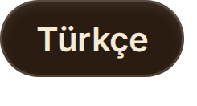

  

**你只需和一个主控 agent 对话。它把活儿派给你亲手养成的人格分身（spawn）。** 
**它们的提示词会自我进化——但每次改动都必须通过一场留出考试（held-out），** 
**在*你*按下 Promote 之前，一切都不会上线。**

 

 

&nbsp;&nbsp;&nbsp;&nbsp;&nbsp;&nbsp;&nbsp;&nbsp;&nbsp;&nbsp;

&nbsp;&nbsp;&nbsp;&nbsp;&nbsp;

---

## 一次请求，端到端跑完

  

<em>你只问一次。主控 agent 挑选合适的分身、拆分任务、在内核沙箱里运行生成的代码，然后给出答案——全程都在同一个线程里。</em>

<a href="docs/assets/arslan-clay-60s.mp4"><b>▶ 观看 60 秒短片</b></a>——与<a href="https://mirzatghayrat.github.io/arslan/">官网</a>同源的黏土动画短片。 上面的界面截图来自已发布的客户端，未经修饰。

**Arslan 是一个本地优先（local-first）的个人 AI 编排器。**它跑在你自己的机器上、用你自己的 LLM 密钥，自带**默认安全的内核沙箱**、**诚实护栏**，以及一个可浏览、可编辑的**可见第二大脑**。

## 为什么选择 Arslan

| | |
|---|---|
|  **一支由你亲手养成的人格团队** | Arslan 是前门；门后是你一手组建的专家分身阵容——为它们配上工具、`SKILL.md` 技能包和 MCP 服务器，再让两级进化循环随时间不断打磨它们。 |
|  **带考试关卡的自我进化** | 分身的提示词会依据自己的运行历史自我修订——然后在留出的历史任务上与在任版本对打,盲评、左右位置互换。它必须**在至少 10 组留出对局中赢下 60% 以上**,并且**没有任何一个维度**(fabrication / identity / completion)**比在任版本更差**。通过 → 一份清晰可读的 diff 送进你的收件箱。**在你按下 Promote 之前,任何改动都不会生效。** |
|  **默认安全，而不是一纸免责声明** | 生成的代码在内核强制的沙箱（macOS seatbelt）里断网运行。凭证注入代理让沙箱内的 git 能够访问网络，而原始令牌永远不会进入沙箱。在内核沙箱不可用的地方，它会**失效关闭（fail closed）**。 |
|  **可浏览、可修正的第二大脑** | 资料、心得、个人档案和 `[[wiki-link]]` 笔记——FTS5 + 向量嵌入的混合检索,还能以 Obsidian 风格的力导向图浏览。每条记录都带着它何时生效、被什么取代,图谱可以**按生效时刻筛选**——这是对现存条目的筛选,不是历史回放。 |
|  **诚实是设计出来的** | 护栏会拦截“我已经做过了”这类凭空捏造,让 agent 的自我汇报始终与真实执行过的内容挂钩。**删除**永远不会自行生效——它会先落进收件箱,由你接受或驳回。主控 agent 的**覆盖**会立即生效,但它写的是一个指针而不是抹掉原文:原记录仍在,一键即可撤销。分身对共享记忆提出的任何改动同样要走收件箱。 |
|  **本地优先,自带密钥** | 你的机器、你的 API 密钥,中间**没有任何第三方服务器**。配置多家供应商后,你可以开启跨供应商路由(默认只用一个模型);评审(judge)与路由(router)角色始终锁定在你的主模型上,评估不会漂到更便宜的模型上。开箱即带 6 种语言的 i18n 和 6 套主题配色(明暗双版)。 |

后端：FastAPI + 异步 SQLAlchemy/SQLite（`server/`）· 前端：React 19 + TypeScript + Vite（`web/`）· 链路追踪、LLM 评审评测和 Grafana 风格的诊断面板共同为进化循环供能。

## 走进真实的客户端

  

## 一次请求如何流转

  

## 自我进化，由你把关

  

分身的提示词会被自动修订——但在你看到它之前,它必须先在留出的历史任务上证明自己:至少 10 组非平局对局、其中胜率不低于 60%,且没有任何一个维度比在任版本更差。合成任务上的胜利不能掩盖真实任务上的退步,候选版本也不能靠把回答写长来取胜。不通过 → 直接丢弃,永远不会浮出水面。通过 → 一张附带清晰可读 diff 的提案卡片;改动**只在你点击 Promote 时才落地**。

## 可按生效时刻筛选的第二大脑

  

记忆会自行生长——路由器抽取的事实 + 会话结束时的蒸馏——分身再通过 FTS5 + 向量嵌入的混合检索把它读回来。每条记录都带着它何时生效、被什么取代,你可以按生效时刻筛选这张 Obsidian 风格的图谱。这里要说准确:它筛的是**现在还存在**的条目,不是历史回放——删除和就地编辑都不留痕迹,而一条记录的“终止时刻”是从它的后继推出来的,并没有被记录下来。当模型想**删除**某条记忆时,提案会先进你的收件箱;主控 agent 的**覆盖**会立即生效,但被取代的那条仍在,一键即可恢复。

## 安装

**桌面版就是使用 Arslan 的方式**——已签名、已公证、自动保持最新:

<a href="https://github.com/mirzatghayrat/arslan/releases/latest/download/Arslan-macos-arm64.dmg"><b>⬇ 下载 macOS 版 Arslan</b></a>(Apple Silicon)——打开 DMG,把 Arslan 拖进「应用程序」。

首次启动时在设置里填入你的模型 API key,即可开用。

从源码运行或使用 Docker(贡献者 / 自部署):见 **[docs/QUICKSTART.md](docs/QUICKSTART.md)**。

## 安全态势

  

Arslan **默认安全**：

- **默认只监听 localhost。** Dev + localhost 有意不做鉴权（本地便利）。跨站 drive-by 请求会被 TrustedHost + CORS + WebSocket-Origin 检查拦截；非 localhost / 生产部署必须设置下方的白名单。
- **令牌用在刀刃上。** `prod`、打包构建与非回环绑定都要求 bearer 令牌——自动生成、自动持久化，并可在设置中轮换，绝不会把你锁在门外。
- **密钥拒绝公开 key。** BYOK 密钥使用 Fernet 加密，其密钥由 `ARSLAN_SECRET_KEY` 经 PBKDF2-HMAC-SHA256 结合每次安装独立的盐派生而来；应用拒绝在内置的公开开发 key 下写入任何密钥。
- **沙箱失效即关闭。** 生成的代码在 macOS seatbelt 下断网运行；内核沙箱不可用时直接失效关闭，绝不悄悄裸奔。

**没有令牌和 host/origin 白名单，切勿把服务器暴露给不受信任的网络。** 完整威胁模型与报告策略：[SECURITY.md](SECURITY.md)。

<b>环境变量（完整参考）</b>

 

| 环境变量 | 默认值 | 用途 |
| --- | --- | --- |
| `ARSLAN_SECRET_KEY` | *(dev 下自动生成)* | 派生用于静态加密已存 BYOK 密钥的 Fernet key。Dev：未设置 → 首次启动时自动生成、持久化到 `~/.arslan/secret_key`，之后一直复用；显式设置的值永远优先（与已持久化文件不一致时会记录一条警告）。在 `prod` 中缺失即启动失败，且**绝不**读取持久化的 dev 文件。 |
| `ARSLAN_SECRET_KEY_FILE` | `~/.arslan/secret_key` | 仅限 dev：自动生成的密钥的持久化位置——刻意放在数据目录**之外**（备份 = 数据目录 **+** 此文件）。设为**空**可彻底禁用自动生成。在 `prod` 中被忽略。任何会加载服务器配置的 dev 入口（服务器、迁移 CLI、诊断工具）都可能在首次使用时生成它；每次生成都会打印一行说明其位置。 |
| `ARSLAN_API_TOKEN` | *(空)* | API/WS bearer 令牌。**Dev + localhost 下留空 = 不鉴权**（零阻力本地体验）。对 prod / 打包 / 非回环绑定，首次运行会自动生成令牌（见下文）。 |
| `ARSLAN_DATA_DIR` | 平台应用数据目录 | 数据库、笔记与密钥的安身之处。未设置 → macOS `~/Library/Application Support/Arslan`、Linux `~/.local/share/Arslan`、Windows `%APPDATA%/Arslan`。**此目录加上你的密钥就是备份单元**（见[数据与备份](#数据与备份)）。 |
| `ARSLAN_ENV` | `dev` | `dev` 或 `prod`。`prod` 要求令牌并收紧各项默认值；`prod` 中缺失 `ARSLAN_SECRET_KEY` 即启动失败。 |
| `ARSLAN_ALLOWED_HOSTS` | 仅 localhost | 逗号分隔的 TrustedHost 白名单，供非 localhost / 生产部署使用。 |
| `ARSLAN_ALLOWED_ORIGINS` | 仅 localhost | 逗号分隔的 CORS + WebSocket-Origin 白名单，供非 localhost / 生产部署使用。 |
| `ARSLAN_ALLOW_INSECURE_SECRETS` | *(关闭)* | 仅限 dev 的逃生舱：允许在公开默认 key 下写入密钥。**绝不要用于真实密钥。** |
| `ARSLAN_ALLOW_UNSANDBOXED_PY` | *(关闭)* | 仅限 dev 的逃生舱：在没有任何可用沙箱时，允许生成的 Python **不带沙箱**运行。届时任意代码将带着服务器的权限与网络访问运行；此类运行会被标记为 `sandboxed=false` 以供审计。只在你完全信任的机器上启用。 |

对 prod / 打包（`ARSLAN_PACKAGED=1`）/ 非回环绑定，若 `ARSLAN_API_TOKEN` 为空，应用会在首次运行时**自动生成**令牌，持久化到 `<data_dir>/api_token`（仅属主可读），在启动时打印一次，并允许你在设置中查看/重置。

<b>数据与备份</b>

 

所有重要的东西都住在同一个目录里——数据库、你的笔记、加密后的密钥——由 `ARSLAN_DATA_DIR` 解析而来（未设置则用平台应用数据目录）。**这个目录本身就是备份单元：**复制它即完成备份，复制回去即完成恢复。请连同其中的 `api_token` 与 `crypto_salt` 文件一起保留——新方案（PBKDF2）加密的密钥由 `ARSLAN_SECRET_KEY` **加上**每次安装独立的 `crypto_salt` 共同派生，丢失（或错配）`crypto_salt` 会让这些已存密钥即便拿着正确的 `ARSLAN_SECRET_KEY` 也无法解密。

一个刻意的例外：密钥本身住在该目录**之外**。如果你从未亲自设置过 `ARSLAN_SECRET_KEY`，dev 自动生成的值就放在 `~/.arslan/secret_key`——这样，单凭一份拷贝走的数据目录无法解密你存储的供应商密钥（锁和箱子分开旅行）。因此一份完整备份是**两件东西**：数据目录，**加上**密钥（你的环境变量值或那个文件）。

## 项目现状 — 诚实面对已验证的部分

**Pre-v1。** 我们宁可少说，也不夸大：

- **macOS 优先。** 内核沙箱目前仅支持 macOS seatbelt；在其他平台上它会失效关闭（Linux / Windows 计划稍后通过 Tauri 桌面应用支持）。
- **自我进化的 agent 团队仍在加固中。** 两级进化循环能够工作，但我们尚不宣称它已完全经受验证——请把它当作正在成熟，而非已经完工。
- **Agentic 记忆读写需要支持原生工具调用的供应商。** `recall`/`remember` 工具只会在真正执行工具调用的供应商上触发（例如 DeepSeek）。在直连 Anthropic 后端上它们永远不会触发——那条路径刻意保持纯文本进出，工具 schema 根本不会发给模型。无论如何，记忆仍会自动形成（路由器抽取的事实 + 会话结束时的蒸馏），与这项功能无关。
- **两个会花钱的后台循环出厂即关闭。** 自动进化与睡眠时段整理各自按自己的节奏调用 LLM，因此默认全部关闭——由你在设置中开启。目前还没有可用的花费上限：运行前的估算是已知偏高的高估值，且会随你的语料增长而膨胀，因此不会依据它强制执行任何限制。在修复之前，请在供应商的账单后台设置硬性限额来兜底。
- 在 v1 之前，API、schema 与默认值都可能发生变化。

## 社区

-  发现 bug 或有好点子？[提交 issue](https://github.com/mirzatghayrat/arslan/issues)。
-  想搭把手？从 [CONTRIBUTING.md](CONTRIBUTING.md) 开始。
-  项目官网源码位于 [`docs/index.html`](docs/index.html)（经 GitHub Pages 提供）。本 README 中的蓝图插图均为手绘 SVG——源文件见 [`docs/diagrams/`](docs/diagrams/)。

## 许可证

Apache-2.0。参见 [LICENSE](LICENSE) 与 [NOTICE](NOTICE)。第三方依赖声明见 [THIRD_PARTY_NOTICES.md](THIRD_PARTY_NOTICES.md)。图标：[Lucide](https://lucide.dev)（ISC）。

---

如果 Arslan 打动了你，<a href="https://github.com/mirzatghayrat/arslan/stargazers">点一颗  就能帮更多人发现它</a>。

