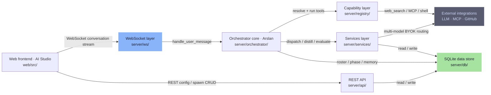
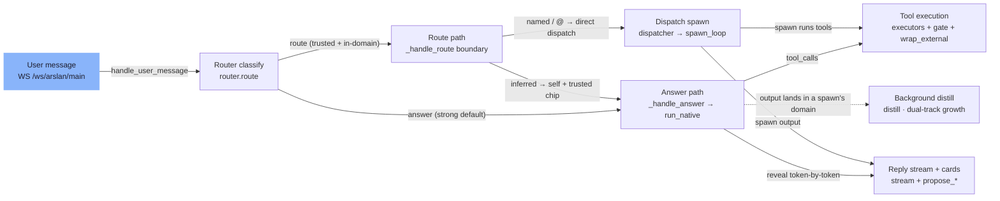
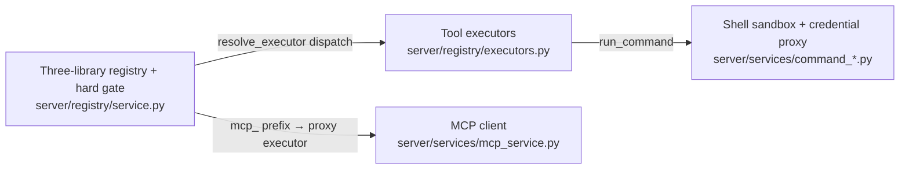
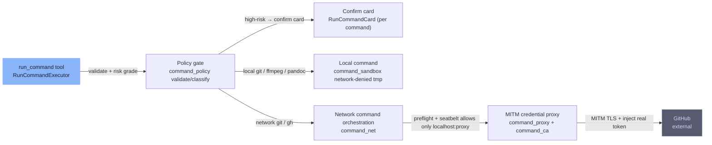
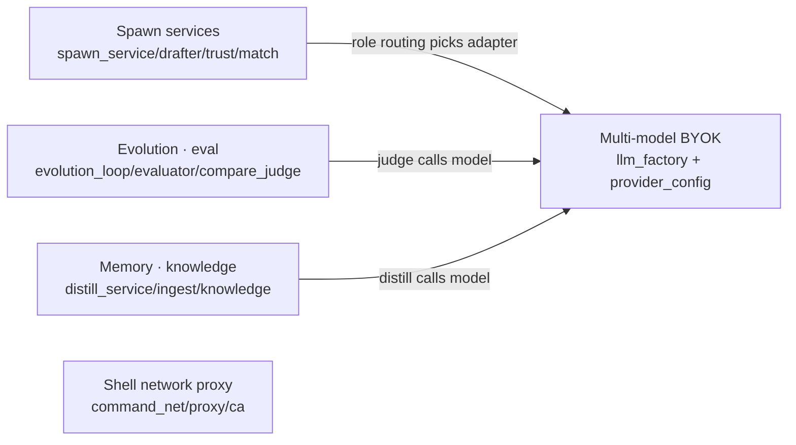

# Arslan architecture

This document explains how Arslan is put together, enough to change it safely. It is the companion to [CONTRIBUTING.md](../CONTRIBUTING.md) (how to get set up and land a PR), the user-facing [README.md](../README.md) (what it is + quickstart), and [SECURITY.md](../SECURITY.md) (threat model). It reflects the code as of today (post S0/S1/S2 — safe-by-default auth, honesty guardrails, and a real two-tier evolution loop).

> The diagrams below are synthesized from an internal architecture knowledge base (not published with the open-source release) and re-drawn in English. They render natively on GitHub.

## What Arslan is

Arslan is a **local-first, BYOK (bring-your-own-key), multi-agent orchestrator**. You talk to **one main agent — "Arslan"** (the host/orchestrator). For each message Arslan either **answers it itself** (running built-in tools) or **delegates to a persona sub-agent** (a "spawn") that it can create, equip, and evolve. Everything runs on your machine, against your own LLM keys.

- **Backend** — FastAPI. A **WebSocket** channel carries the live conversation stream; **REST** (`/api/v1`) carries configuration and spawn/knowledge management. Async SQLAlchemy over a single **SQLite** file stores spawns, the roster, the knowledge base (FTS5), run records, and encrypted provider keys. (`server/`)
- **Frontend** — an AI-Studio-style React 19 + TypeScript + Vite single-page app. (`web/src/`)
- **The "shape" of the product** — talk → a self-evolving team of agents. A capability layer (built-in tools + an MCP client + `SKILL.md` skill packs) behind a single write gate; a kernel sandbox + credential proxy for generated code; honesty guardrails; a visible "second brain"; and a two-tier evolution loop.

### Subsystems at a glance

| Subsystem | Lives in | Role |
| --- | --- | --- |
| Frontend | `web/src/` | AI-Studio SPA: conversation workbench, decision cards, spawn management, capability library, second brain, diagnosis/replay, settings |
| REST API | `server/api/` | `/api/v1` config + spawn/knowledge/runs/evolution CRUD |
| WebSocket layer | `server/ws/` | Conversation stream frames + accept-frame handling |
| Orchestrator core | `server/orchestrator/` | The Arslan host loop: route vs. answer vs. dispatch, native tool-calling |
| Capability layer | `server/registry/` | Three-library registry (Tools / MCP / Skills), executors, the single write gate |
| Services layer | `server/services/` | ~45 modules: BYOK routing, spawn services, evolution/eval, memory/distill, shell-net proxy |
| Data store | `server/db/` | SQLite schema, models, hand-wired boot migrations |
| External | (third-party) | BYOK LLM providers, MCP servers, GitHub, web-search providers |

*Figure 1 — Overall architecture. The frontend drives two channels (WS for the conversation stream, REST for config). The orchestrator core is the hub; it runs tools through the capability layer, calls services, and reads/writes the SQLite store.*

## Request lifecycle

A single user message travels end-to-end like this: **WS entry → router classifies (doer-first) → answer it directly, or route to the boundary decision → native tool-calling runs tools / dispatches a spawn → reply streams token-by-token with decision cards → if the work lands in a spawn's domain, it is distilled into that spawn's knowledge in the background.**

*Figure 2 — Request lifecycle.*

Stage by stage:

1. **WS entry** (`server/ws/arslan.py`) — the browser connects to `ws://…/ws/arslan/main` and sends a `user_message`. `handle_user_message` drives the turn.
2. **Router** (`server/orchestrator/router.py`) — one structured JSON decision: `answer` / `route` / `suggest_create` / `clarify` / `suggest_update`. The bias is **doer-first**: if Arslan can do it itself, it returns `answer`. Hallucinated `spawn_id`s are validated and, if bogus, downgraded to `answer`.
3. **Answer path** (`arslan._handle_answer` → `tool_loop.run_native`) — Arslan runs a **native tool-calling loop** using built-in tools (`web_search`, `web_extract`, `render_chart`, shell, …), revealing the reply token-by-token, and returns the produced text for dual-track growth.
4. **Route path** (`arslan._handle_route`) — only fires for **trusted + in-domain** work. A named/`@`-mentioned spawn is dispatched directly (`dispatch_routed`); pure inference stays **doer-first** (Arslan does it, only floating a `propose_invite` chip for a trusted spawn); a non-roster member triggers an invite card first.
5. **Dispatch** (`dispatcher.dispatch` → `spawn_loop.run`) — injects the spawn's skill "technique block" + its wired tools, runs one `run_native` pass (`force_tools`), records a `Run`, and handles escalation.
6. **Reply** — `stream_start` → `stream_chunk`(s) → `stream_end`, plus decision cards (`propose_invite` / staffing / `suggest_create` / `suggest_update` / `run_command` confirm). Ignoring a card and sending a new message **implicitly dismisses it**.
7. **Background distill** — when Arslan itself handled work that belongs to a spawn's domain, `distill_from_signals` distills it into that spawn's `memory_facts` (non-blocking, dual-track growth); meta-conclusions surface as `UserFact`s that feed routing.

**Invariants (request lifecycle):** tool results are always passed through `wrap_external` and treated as **untrusted data** (prompt-injection defense); `router` only chooses `route` when trusted + in-domain, otherwise it degrades to `answer`; unacknowledged `propose_*` cards are implicitly dismissed by the next message.

## Orchestrator core

**What it does.** The Arslan host loop decides *do it myself vs. delegate*, runs tools, and stitches the finished product. Files in `server/orchestrator/`.

```mermaid
graph LR
    arslan-host["Arslan host loop<br/>server/orchestrator/arslan.py"]
    router["Router classify<br/>server/orchestrator/router.py"]
    boundary["Boundary · doer-first<br/>arslan.py _handle_route"]
    tool-loop["Tool loop (native)<br/>server/orchestrator/tool_loop.py"]
    spawn-loop["Spawn loop<br/>server/orchestrator/spawn_loop.py"]
    dispatcher["Dispatcher<br/>server/orchestrator/dispatcher.py"]

    arslan-host -->|"stage-1 structured classify"| router
    router -->|"answer → do it myself"| tool-loop
    router -->|"route → boundary decision"| boundary
    boundary -->|"named / house-rule → direct dispatch"| dispatcher
    boundary -->|"inferred → self + trusted chip"| tool-loop
    dispatcher -->|"inject technique + assign"| spawn-loop
    spawn-loop -->|"shares the same loop"| tool-loop
    tool-loop -->|"tool_calls / escalate"| dispatcher
    classDef entry fill:#89b4fa,stroke:#89b4fa,color:#1e1e2e
    class arslan-host entry
```

*Figure 3 — Orchestrator core.*

**Key files & invariants:**

- `router.py` — two-stage routing; a single structured JSON decision with a doer-first bias.
- `tool_loop.py` — the **native tool-calling reliability kernel** (`run_native`). If the model returns `tool_calls`, they run (through the gate / confirm / `wrap_external`) and free-form `content` is treated as a *note, never the answer*; with no tool calls, `content` *is* the answer. It also enforces timeout+retry, a search-convergence cap (`_SEARCH_CAP`), a `_synthesize_from_findings` fallback, and a deferral-stub length gate (`_is_deferral_stub`). These exist to cure three failure modes: **narration-as-answer, data leakage, and empty-handedness.**
- `spawn_loop.py` — a dispatched spawn shares the *same* `run_native` kernel (with `force_tools`).
- `dispatcher.py` — injects technique + wired tools, records the run, handles escalation (`grant_temporary`).

## Capability layer

**What it does.** A single, tiered registry of everything an agent can do, behind one write gate. Files in `server/registry/` (plus MCP + shell services it delegates to).

*Figure 4 — Capability layer.*

- **Three libraries** — Tools, Toolsets, and SkillPacks, plus per-spawn `spawn_capabilities`, all in `server/registry/service.py`.
- **Single-throat write gate** — `assert_assignable` is the **only** path that grants a capability, and it only lets through **safe + functional** ones. `safe_menu` lists what is assignable, `wired_tools_for_spawn` resolves a spawn's current capabilities, and `grant_temporary` handles escalation-time temporary grants.
- **Built-in executors** (`server/registry/executors.py`) — `web_search`, `web_extract`, `render_chart`, `deck`, `run_python`, `run_command`, `create_skill`, `list_my_capabilities`, plus an MCP proxy executor (dispatched by the `mcp_` name prefix).
- **Tier isolation invariant** — **orchestrator-tier** capabilities (e.g. `run_command`) are held **implicitly by Arslan only**; a spawn can never be granted one. Shell and MCP are **off by default**.

## Sandbox, security & the command surface

Generated code and shell commands are the most dangerous machinery Arslan runs, so they get their own hardened surface. Files: `server/services/command_policy.py`, `command_sandbox.py`, `command_proxy.py`, `command_ca.py`, `command_net.py`.

*Figure 5 — Command surface.*

**Invariants (command surface; see also `SECURITY.md`):**

- **Whitelist of 4 binaries** — `git`, `gh`, `ffmpeg`, `pandoc` — plus a hard-deny list (`sudo`, `rm`, shell metacharacters). `run_command` is orchestrator-only and off by default.
- **A confirmation card per command**, risk-graded (`ask_all` / `ask_risky`).
- **Local commands run network-denied** in an ephemeral tmp dir under the **macOS seatbelt**. **If the kernel sandbox cannot start, the command is refused — it never silently downgrades.**
- **Network `git`/`gh` go through a local MITM credential-injecting proxy** (`command_proxy` + `command_ca`): seatbelt only allows egress to `localhost:proxy`; the proxy terminates TLS and injects the real token, so **raw credentials never enter the sandbox**. Network is restricted to GitHub + the current repo's remote host, and `git push` is limited to the current branch.
- **`run_python` fails closed** where the kernel sandbox is unavailable (non-macOS). The dev-only escape hatch `ARSLAN_ALLOW_UNSANDBOXED_PY=1` runs generated Python with the server's full privileges and network — runs are marked `sandboxed=false` for audit. See [SECURITY.md](../SECURITY.md).

## Services layer

~45 modules in `server/services/`. The most load-bearing groups:

*Figure 6 — Services layer (LLM factory is the shared model access point).*

### Multi-LLM BYOK routing

`llm_factory.py` + `provider_config_service`. `build_adapter(role)` picks a provider by **role** (`router` / `worker` / `judge` / `synthesis`) with a **quality-first primary** and multiple keys. Keys are encrypted at rest in `provider_configs`. Supports OpenAI-compatible providers (e.g. DeepSeek) and native Gemini. **The shipped product bakes no keys** — BYOK, zero secrets in the repo.

### Spawn services

`spawn_service` (create/store/emit skill-pack), `spawn_drafter` + `persona_seed_service` (a persona seed library and PM-style `create`), `spawn_match_service` (domain-match scoring + `classify_band`), `spawn_trust` (deterministic green/trusted aggregation), `staffing_gather` (a deterministic "who staffs this" gate).

### Second brain (memory & knowledge)

`distill_service` (session distillation, `distill_from_signals`, meta-knowledge upflow via `distill_meta_upflow`), `ingest` (PDF / docx / URL / OCR ingestion), `knowledge` (FTS5 task-scoped retrieval injected into runs), plus `curator` (retire dead skills), `titler`, `storage_intent`. The brain has **materials / learnings / a profile + `[[wiki-link]]` notes**, retrieved with hybrid FTS5 + embeddings and browsable as an Obsidian-style force-directed graph in the UI.

### Evolution & evaluation

`evaluator` (a **4-dimension LLM judge**), `compare_judge` (A/B), `run_eval_service`, `evolution_loop`/`service`, `skill_forge`/`optimizer` (frozen SkillOpt optimizer), `github_eval`. The loop is two-tier:

- **Tier 1** — online instruction-suffix refinement (rule-level).
- **Tier 2** — offline, **bounded** capability edits, with **position-bias elimination** in judging and a **human "promote" gate** — no change ships itself. Promotions land in the UI's evolution inbox as reviewable line-diffs.

> **Status honesty (matches [README.md](../README.md#status)):** the two-tier loop works but is **not yet claimed as fully proven** — treat it as maturing, not finished.

## WebSocket layer

`server/ws/` — `arslan.py` (main orchestration socket), `chat.py`, `sandbox.py`. It carries the conversation-stream frames (`stream_start` / `stream_chunk` / `stream_end`, `tool_call` / `result`, routing decisions, `propose_*` cards, roster events) and processes inbound accept frames (`roster_invite` / `dismiss` / `confirm_update`, etc.). The WS handshake enforces the same auth + Origin checks as REST (see below).

## REST API

`server/api/`, all under the `/api/v1` prefix: `spawns`, `settings`, `knowledge`, `mcp`, `runs`, `evolution`, `facts`, `registry`, `create`, `seeds`, `templates`, `health`. Anything that is not the live conversation stream goes here — the frontend reads/writes config and spawn state over REST.

## Data store & data model

**SQLite, one file.** `server/db/` holds `models.py` (SQLAlchemy models), `session.py` (`AsyncSessionLocal`, async engine), and `migrations/`. Access is async via `sqlite+aiosqlite`.

**Notable tables:** `spawns`, `spawn_capabilities`, `roster`, `spawn_phase`, `knowledge_chunks` + FTS5, `user_facts`, `arslan_messages`, `arslan_summaries`, `runs` / `run_evaluations`, `evolution_proposals`, `router_decisions`, `conversation_events`, `notes` (+ `notes_fts`), `provider_configs` (encrypted keys), `mcp_servers`.

**Key data-model facts to keep in mind before you change schema:**

- **The data directory is the unit of truth; a complete backup is TWO pieces.** The DB, your notes, the encrypted secrets, `crypto_salt`, and `api_token` all live under `ARSLAN_DATA_DIR` (or the platform app-data dir). Back it up / restore it **as a whole** — losing `crypto_salt` makes PBKDF2-encrypted BYOK secrets undecryptable even with the right `ARSLAN_SECRET_KEY`. The secret itself deliberately lives **outside** the data dir (explicit env value, or the dev auto-generated `~/.arslan/secret_key`), so back up the data directory **plus** that secret.
- **There is no `Conversation` entity.** `conversation_id` is just a **string** threaded through messages/events; there is no conversations table to join.
- **Migrations run through a versioned runner at boot, not `alembic upgrade`.** Each schema change is a `server/db/migrations/versions/_00NN_name.py` file exposing an **idempotent** `upgrade_sync(connection)` (guarded with `PRAGMA table_info(...)` + `exec_driver_sql`). The ordered registry `server/db/migrations/runner.py::MIGRATIONS` is the single source of truth; `apply_pending` records applied ids in a `schema_version` ledger and runs only the pending tail. Boot calls it in `server/main.py`'s `lifespan()` — `Base.metadata.create_all` first, then `await conn.run_sync(runner.apply_pending)`, in one transaction — and the same runner is a CLI (`python -m server.db.migrations.runner`) for packaged/ops upgrades. A version file **not** registered in `MIGRATIONS` never runs, and a completeness test fails CI to catch it. (alembic was removed — the runner is the operative mechanism; see [CONTRIBUTING.md](../CONTRIBUTING.md#versioned-migrations).)

## External integrations

Third-party, outside the repo: BYOK LLM providers (OpenAI-compatible / DeepSeek, native Gemini), MCP servers (GitHub / Memory / Fetch / Notion, launched as **stdio subprocesses** you configure), GitHub (via the shell credential proxy), and web-search providers.

## Cross-cutting invariants

Reliability and safety here rest on a handful of load-bearing rules. Preserve them; don't weaken one without a design discussion.

- **Single-throat capability gate.** All capability grants pass through `assert_assignable`; shell/MCP off by default; **orchestrator-tier is Arslan-only** (spawns can't get it).
- **Untrusted tool output.** Every tool result goes through `wrap_external` and is treated as untrusted data.
- **Sandbox fails closed.** No kernel sandbox → refuse to run (the macOS seatbelt is the only kernel sandbox today; other platforms are unavailable and fail closed).
- **Credentials never enter the sandbox.** The MITM proxy injects tokens outside it.
- **Honesty guardrails.** The framework intercepts fabricated "I already did that" claims (`promise_guard`, two-level) and keeps self-reporting tied to what actually ran; a `persona_lint` keeps equipment/persona consistent. Router/synthesis lean on an LLM and can be flaky, so framework floors (timeout+retry, search-convergence cap, findings-digest floor, deferral-stub gate) guarantee it **never returns empty-handed and never leaks**.
- **Evolution is human-gated.** Tier-2 edits are bounded, position-bias-corrected, and only ship on an explicit human promote.
- **Safe-by-default auth.** Dev + localhost is unauthenticated on purpose; `prod` / packaged / non-loopback binds require a bearer token (auto-minted if unset), and cross-site requests are blocked by TrustedHost + CORS + WebSocket-Origin checks. See [SECURITY.md](../SECURITY.md).

## Where to read more

- [CONTRIBUTING.md](../CONTRIBUTING.md) — dev setup, the exact checks CI runs, conventions, PR flow.
- [README.md](../README.md) — product overview, quickstart, environment variables, status.
- [SECURITY.md](../SECURITY.md) — full threat model, known boundaries, and vulnerability reporting.
- Design specs, implementation plans and the architecture knowledge base these diagrams are drawn from are **internal research records and are not published with the open-source release**.
